目标检测类算法综述

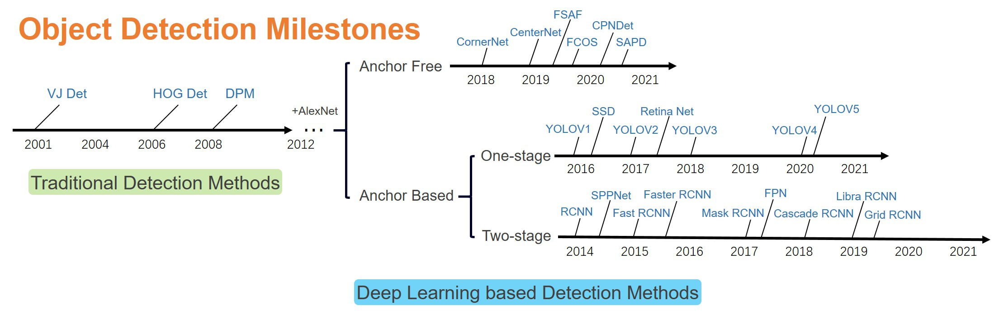

这里有三遍论文：

双阶段：Faster R-CNN

单阶段：YOLOV5

基于Transformer：《Focal Self-attention for Local-Global Interactions in Vision Transformers》

## Faster R-CNN

目标检测的步骤：

- 候选区域生成 Region Proposal
- 特征提取 Feature Extraction
- 分类 Classification
- 位置精调 Rect Refine

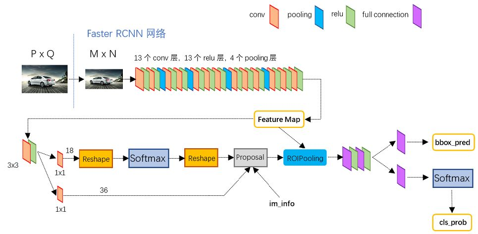

### 网络结构说明

#### 生成特征图 Feature Map

采用VGG-16网络结构，去掉后面的一个maxpool和三层全连接，如下图

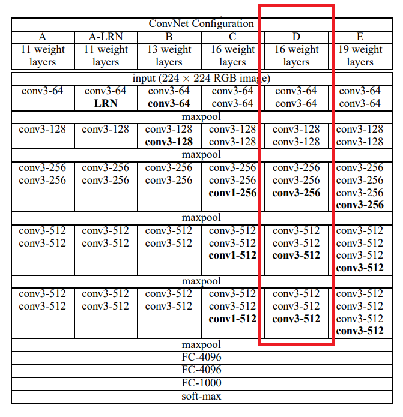

- 其中共有13个卷积层：$KernalSize = 3 \times 3、pad =  1、stride = 1$
  - 每次卷积后宽高不变

- 除去最后的MaxPool共有4个Pooling层：$KernalSize = 2 \times 2、pad = 0、stride = 2$
  - 每次池化后宽高变为原来的一般

原图大小为 $800 \times 600$ 的三通道图经过VGG之后变为

- $W = {800 \over 2^4} = 50、W = {600 \over 2^4} = 38、C = 512$ 即 $50 \times 38 \times 512$ 

#### 生成候选区域

通过 RPN `Region Proposal Network`，如下图

红框部分如下图

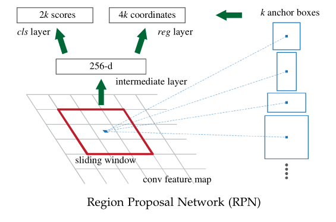

- 使用 $3 \times 3$ 的卷积核作为 sliding window，在每个滑动窗口的位置，我们生成 $k$ 个建议区域 Anchor Box

  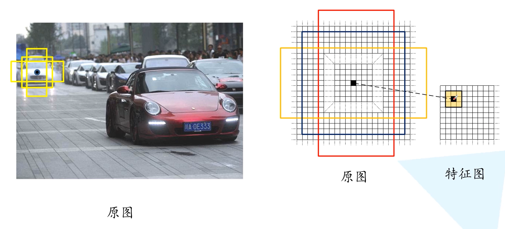

- 分类和回归

  $CLS = [0.1, 0.9, 0.6, 0.4, 0.2, 0.8, ...]$ 表示当前Anchor Box是背景和目标的概率，如 $[0.1, 0.9]$ 则表示背景概率为 0.1， 是目标概率为 0.9

  如果 $k = 9$ 则 CLS 的大小为 $2 \times 9 = 18$

  

  $REG = [D_x^1, D_y^1, D_w^1, D_h^1, D_x^2, D_y^2, D_w^2, D_h^2, ...]$ 每四个为一组，表达当前Anchor Box 在原图的位置

  如果 $k = 9$ 则 REG 的大小为 $4 \times 9 = 36$

- 对于宽高分别为 W和H的特征图，生成的 Anchor Box 数目为 $W \times H \times k$

- 图中生成特征图使用的是ZF model，故经过RPN后为 256-dim 的特征图，如果使用VGG-16，则为 512dim

  > Each sliding window is mapped to a lower-dimensional feature (256-d for ZF and 512-d for VGG, with ReLU following). 

- softmax判定positive与negative

- bounding box regression 对 positive box 框进行微调，使得 得positive anchors和Ground Truth更加接近。

- Proposal层则负责综合positive anchors和对应bounding box regression偏移量获取proposals

  同时剔除太小和超出边界的proposals，做NMS（相当于目标定位的功能）。

- im_info 保存了缩放后图片宽高以及缩放比例

RPN网络结构流程： 生成anchors $\rightarrow$ softmax分类器提取positvie anchors $\rightarrow$ bbox reg回归positive anchors $\rightarrow$ Proposal Layer生成proposals

#### 目标分类与候选框位置精调

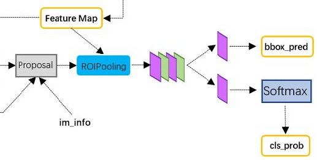

##### RoI Pooling

输出尺寸相同的特征图，其流程如下

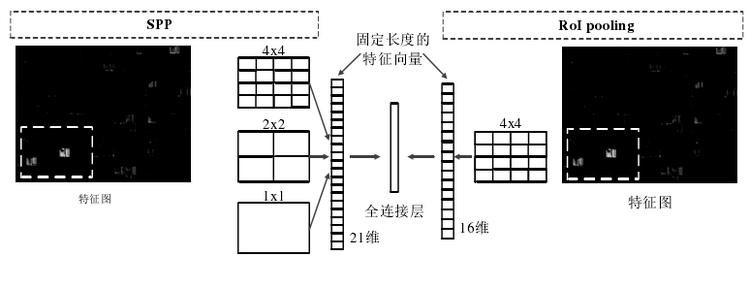

- 将ROI映射到特征图对应位置上

- 将映射后的区域划分为相同大小的区块

- 对每个区块进行max pooling操作

  如下 显示了对一个ROI的处理过程，对于不同大小的ROI，该方法处理可以得到相同尺寸(2 x 2)的输出，region proposals 大小为5 x 7
  
  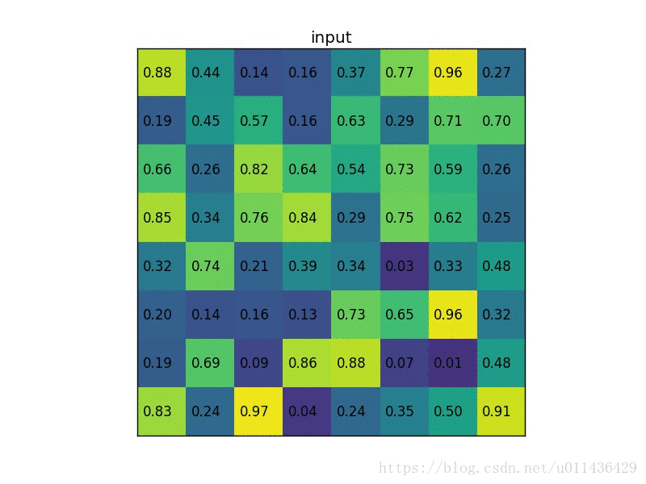

通过full connect层与softmax计算每个proposal具体属于那个类别（如猫、狗、兔子等），输出cls_prob概率向量；

同时再次利用bounding box regression获得每个proposal的位置偏移量bbox_pred，用于回归更加精确的目标检测框。

### 总结

- 原图假设为 $800 \times 600$

- VGG 输出特征图大小为 $50 \times 38 \times 512$

- 获取 $50 \times 38 \times k$ 个 Anchor Box

  - RPN输出 $50 \times 38 \times 2k$ 个分类矩阵， $50 \times 38 \times 4k$ 个坐标矩阵（对应原图的）

  

- 将原图坐标映射到特征图上，并输入大小相同的特征向量
  - 经过全连接层做分类
  - 经过 bounding box regression 调整目标检测框使其更加精确

### 参考

博客：

https://zhuanlan.zhihu.com/p/31426458

https://zhuanlan.zhihu.com/p/145842317

论文地址：https://arxiv.org/pdf/1506.01497.pdf

## YOLOV5

## FSA(Focal Self-attention)

### 前置知识

#### Self-Attention

> 论文地址：https://arxiv.org/pdf/1706.03762.pdf
>
> 参考博客：https://zhuanlan.zhihu.com/p/37601161
>
> 参考课程：https://www.bilibili.com/video/BV1v3411r78R
>
> 参考论文：
>
> - CNN 与 Self-Attention 之间的关系：https://arxiv.org/pdf/1911.03584.pdf

- 输入为多个向量且长度不定

  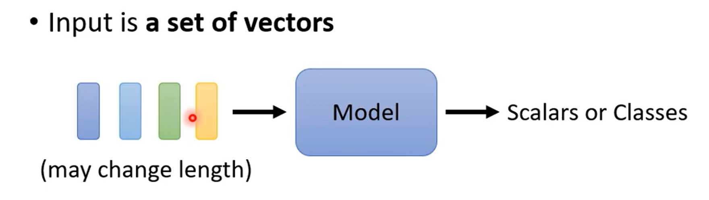

  如一段文字：`This is a cat`，输入4个向量，每个向量长度各异

  如何表示每个向量？

  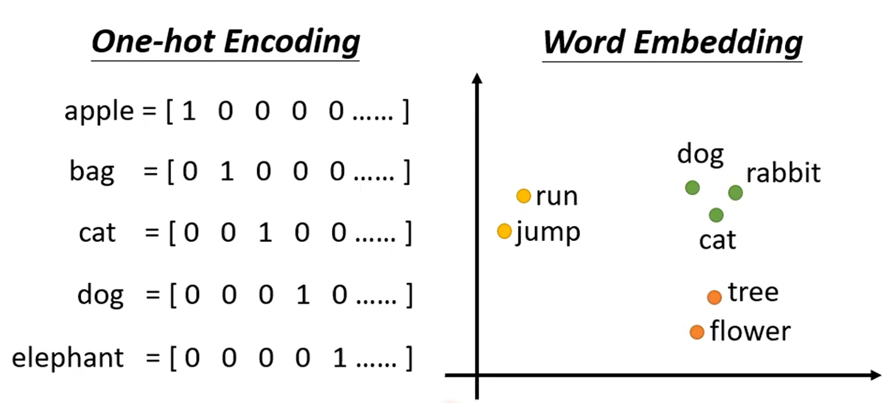

  - On-Hot Encoding （基于词袋模型）

    穷尽所有的单词，给每个单词一个编码

    假设一共有四个单词`This is a cat`，则编码可以为 1000 0100 0010 0001

    没有语义信息

  - Word Embedding

Sequence Labeling

> I saw a saw （我看到一个锯子）

- 看到当前单词需要通过 整个句子的信息进行分析

  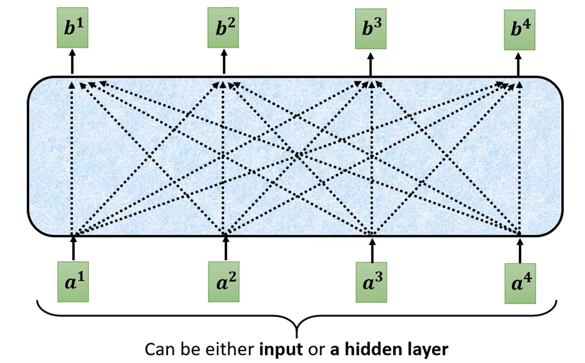

- 找到与 $a^i$ 与 $a^j$ 之间的关联（Attention score） $\alpha_{i,j}$  —— Dot-Product

   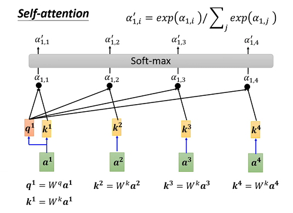

  

- 根据 Attention Scores 来提取信息

   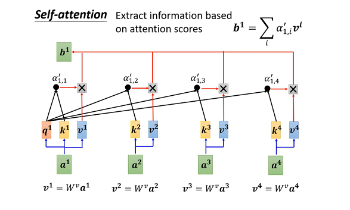

  $b^1$ 与哪一个 $v^k$ 的值越接近，则 $a^1$ 与 $a^k$ 的关联度越大。

  

经过上面的操作后会由 $a^i$ 生成 $b^i, \quad i = 1,\ 2,\ 3,\ 4\ $

- 运行过程

  $W^q、W^k、W^v$ 通过训练生成

  - $a^i \rightarrow \{\ q^i, \ ,k^i\ ,v^i \ \}$
    - $Q = \{q^1, q^2, q^3, q^4\} = W^q \{a^1, a^2, a^3, a^4\} $
    - $K = \{k^1, k^2, k^3, k^4\} = W^k \{a^1, a^2, a^3, a^4\} $
    - $V = \{v^1, v^2, v^3, v^4\} = W^v \{a^1, a^2, a^3, a^4\} $
  - $<q^i, k^j> \rightarrow \alpha_{i, j}$ 得到 Attention scores
    - $A^i = K^T q^i \rightarrow A = K^T Q$

  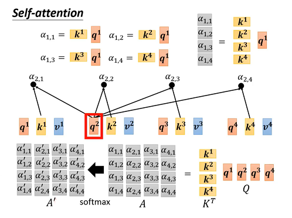

  - $b^i = V * A^i \rightarrow B = V A'$

    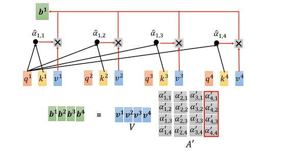

- CNN 与 Self-Attention
  - 注意力机制是复杂版本的CNN，机器自动学习需要的感受野大小（CNN中是手动设置卷积核大小）
  - Self-Attention 弹性较大，需要更多的数据

#### Vision Transformer 

The Model of Sequence-to-Sequence (Seq2Seq)

>参考论文：
>
>- 目标检测：https://arxiv.org/pdf/2005.12872.pdf
>
>

模型决定输出的类别数

- 语音识别：声音信息 $\rightarrow$ 文字序列
- 机器翻译：一种语言文字 $\rightarrow$ 另一种语言文字
- 语音翻译：声音信息 $\rightarrow$ 另一种语言文字

##### Encoder & Decoder

Input Sequence $\rightarrow$ Encoder $\rightarrow$ Decoder $\rightarrow$ Output Sequence

左边 Encoder ，右边 Decoder

Decoder 比 Encoder 多出了中间的中间的 Multi-Head Attention（用于 Encoder 和 Decoder 之间通信）

- Masked Multi-Head Attention
  - 输出是依次的串行关系，只需要考虑前面已经输入的

- Add & Norm ：Residual残差 + Layer Norm

**Decoder — Autoregressive**

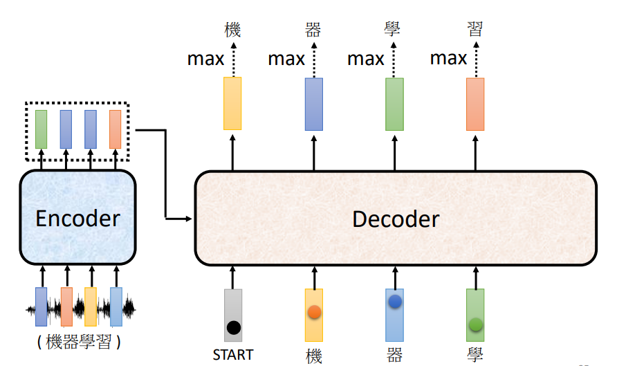

前一个输出作为下一个输入

**二者之间的通信**

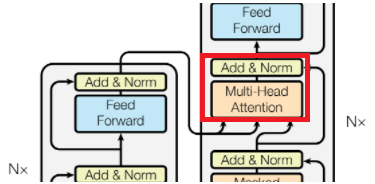

Cross Attention：两个输入来自 Encoder，一个来自Decoder，运作过程如下 

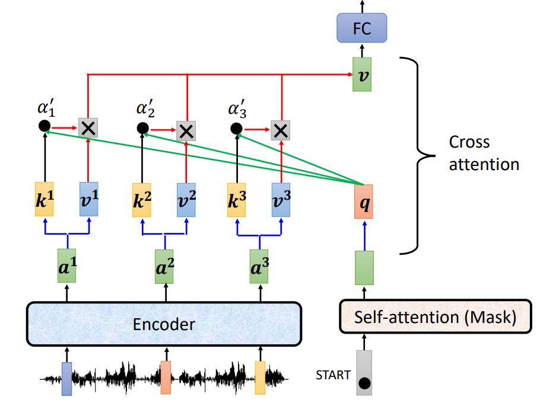

如上图 k、v 来自 Encoder，q 来自Decoder

##### 训练

- Copy Mechanism

  Decoder 从 Encoder 复制一些消息

  - 聊天

    > Encoder: Hi, I am **Bob**
    >
    > Machine: Hello **Bob**, How are you ?

  - 摘要

- Guided Attention

- Beam Search  

### 论文解读

#### 概述

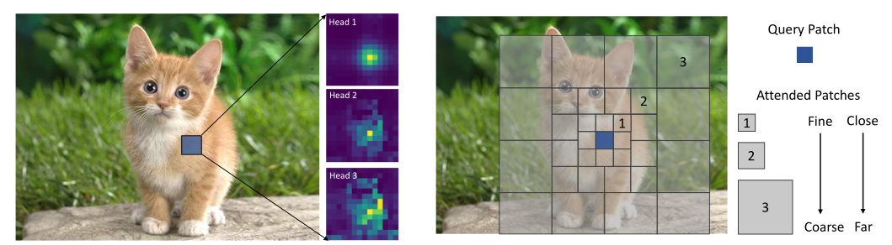

    图1.1 使用三个粒度级别组成蓝色查询的注意区域

最近的研究要么利用粗粒度全局自注意，要么利用细粒度局部自注意来减少计算负担。

然而，这两种方法都削弱了Self-Attention的建模能力。比如：同时模拟短期和长期视觉依赖的能力，

> perform the fine-grained self-attention only in local regions while the coarse-grained attentions globally.
>
> ——  self-attention

#### 方法

##### 模型结构

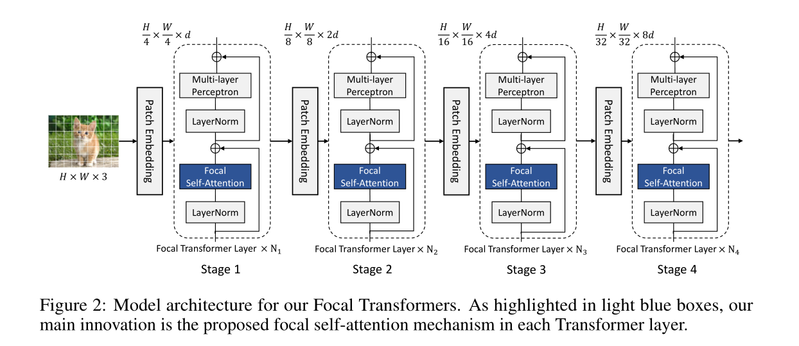

- Patch Embedding

  卷积核大小为 4 ， 步长为 4 图片大小变为 $\rightarrow {H \over 4} \times { W \over 4 } \times d$ 的特征图

  每经过一个Patch Embedding，维度增加一倍，宽高缩小一倍

- Image Classification

  - we take the average of the output from last stage and send it to a classification layer

- Object Detaction

  -  the feature maps from last 3 or all 4 stages are fed to the detector head

##### Focal self-attention

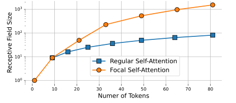

> Area of receptive field for standard self-attention and our focal self-attention when we gradually add more attended tokens.

**Window-wise attention**

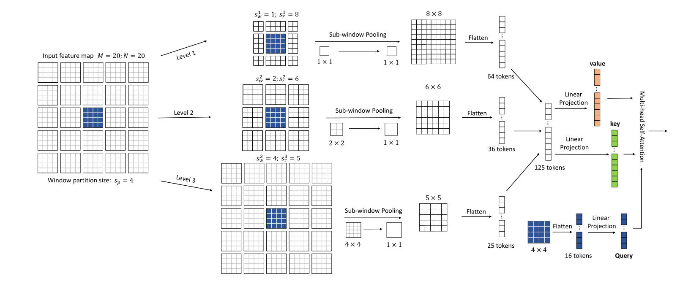

> An illustration of our focal self-attention at window level. 
>
> Each of the finest square cell represents a visual token either from the original feature map or the squeezed ones. 
>
> Suppose we have an input feature map of size $20 \times 20$. We first partition it into $5 \times 5$ windows of size $4 \times 4$. 
>
> （将 $20 \times 20$ 的特征图切分成 $5 \times 5$ 的小窗口，每个小窗口的大小为 $4 \times 4$）
>
> Take the $4 \times 4$ blue window in the middle as the query, we extract its surroundings tokens at multiple granularity levels as its keys and values. 
>
> - For the first level, we extract the $8 \times 8$ tokens which are closest to the blue window at the finest grain. 
>
> - Then at the second level, we expand the attention region and pool the surrounding $2 \times 2$ sub-windows, which results in $6 \times 6$ pooled tokens.
> -  At the third level, we attend even larger region covering the whole feature map and pool $4 \times 4$ sub-windows. 
>
> Finally, these three levels of tokens are concatenated to compute the keys and values for the $4 \times 4 = 16$  tokens (queries) in the blue window.
>
> （最后，将这三层Token连接起来组成 125个tokens，在映射中添加以蓝色区域生成的 $4 \times 4 = 16$ 个tokens为KEY，以该 125个tokens为Value 的项用以查询）

- 然后以中心蓝色区域为中心点，生成三个不同大小的图片区域，分别为
  -  $8 \times 8 \rightarrow 1 \times 1 的池化 \rightarrow 8 \times 8$ 
  - $12 \times 12 \rightarrow 2 \times 2 的池化 \rightarrow 6 \times 6$ 
  - $20 \times 20 \rightarrow 4 \times 4 的池化 \rightarrow 5 \times 5$  

名词

- Focal Level $L$ ： the number of granularity levels （粒度级别） we extract the tokens for our focal self-attention.

- Focal window size $s_w^l$： 

  the size of sub-window on which we get the summarized tokens at level $l$，在图1.1中，对应的分别是 1、2、4

  即以中心区域为基准点，有$1 \times 3 : 1.5 \times 4 : \times 1.5 \times 2 \times 4 = 1 : 2 : 4$ 

- Focal window size $s_r^l$：在粒度级别 $l$ 上子窗口的个数，在图1.1中，对应的分别是 3、4、4

  

我们可以使用 $\{L, s_w, s_r\}$ 来确定一个 Self-Attention 模型，主要有以下两个步骤：

1. Sub-window pooling

   输入的特征图空间大小为 $M \times N$，维度为 $d$

   

2. Attention computation

   compute the query at the first level and key and value for all levels using three linear projection layers $f_q, f_k, f_v$

   

#### 结论

##### Limitations and future work

-  introduce extra computational and memory cost
- merely scratched the surface and further study on this aspect is still neede
- we believe our focal attention mechanism is also applicable to monolithicvision Transformers and Transformers in both vision and language domain.

