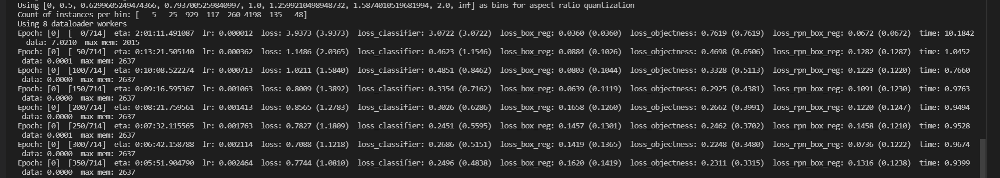

> Range: 2021/10/22 — 2021/10/29    Report Time：2021/10/29

每周汇报

#### 论文阅读

#### 基础学习

#### 实践

一、跑通 Faster R-CNN 代码

二、构建自己的数据集

> [TorchVision Object Detection Finetuning Tutorial — PyTorch Tutorials 1.10.0+cu102 documentation](https://pytorch.org/tutorials/intermediate/torchvision_tutorial.html)
>
> The dataset should inherit from the standard `torch.utils.data.Dataset` class, and implement `__len__` and `__getitem__`.
>
> It is recommended to also implement a `get_height_and_width` method

