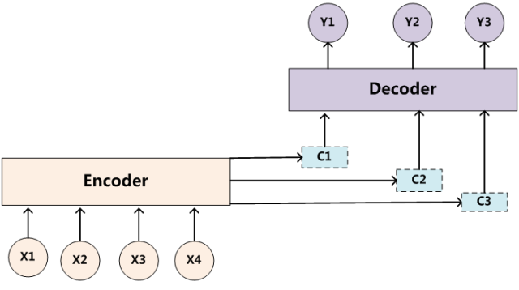

《Focal Self-attention for Local-Global Interactions in Vision Transformers》

图1 Transformer 结构图

### Encoder-Decoder框架

图2 抽象的文本处理领域的Encoder-Decoder框架

**直观理解**

令 $X = (x_1, x_2, x_3, x_4, ..., x_N)、Y = (y_1, y_2, y_3, ..., y_M)$ 

- 语言识别：其中 $X$ 可表示一段语音信号，$Y$ 可表示为语音识别的结果
- 机器翻译：其中 $X$ 可表示一种语言文字，如：`Hello World`，$Y$ 可表示为翻译后的中文，如：`你好世界`
- 语义识别：其中 $X$ 可表示一张图片，如：`黄山上一张松树照片`，$Y$ 可表示为识别后的信息，如：`迎客松`
- 智能客服：其中 $X$ 可表示一个问题，如：`什么时候到货?`，$Y$ 可表示为回答的内容，如：`明天下午`
- ......

即：由一个序列生成另一个序列 `Sequence to Sequence`

**结构说明**

- Encoder 对输入向量 $X$ 进行编码，将句子通过非线性变换的到中间序列 $C$
  $$
  C = \mathcal{F}(X)
  $$

- Decoder 根据中间信息 $C$ 和之前已经生成的历史信息来生成 $i$ 时刻的单词
  $$
  y_i = \mathcal{G}(C, y_1, y_2, ..., y_{i - 1})
  $$

  > **非线性变换** 的原因是因为Encoder一般为神经网络 `RNN、CNN` 等。
  >
  > **之前已经生成的历史信息** 指的是前 $i-1$ 时刻生成的单词

### Attention

#### Soft Attention

##### **Encoder-Decoder 注意力不集中 —— 为什么?**

先看下面的公式
$$
\begin{align}
& y_1 = \mathcal{G}(C) \\
& y_2 = \mathcal{G}(C, y_1) \\
& y_3 = \mathcal{G}(C, y_1, y_2) \\
& ......
\end{align}
$$
因为 $C$ 是由整个输入 $X$ 一次性生成的，故对于 $\forall y_i \in Y $ 的影响是相同的，相当于人在看这一串单词（或一张图片）时候眼睛没有聚焦，所以说 Encoder-Decoder 机制是注意力不集中的。

    
    

图3 注意力集中和不集中对比

如果我们期望输出的是图片中`男孩和女孩手中拿的各是什么`

在回答`男孩手中拿的是什么` 的时候，显然图片中有男孩的那一块图像对于输出结果更重要，并不需要均等的关注整张图片，所以说Encoder-Decoder 种没有引入注意力机制。

> 如果这张图种只有左边三分之一的时候，是否有注意力机制对结果影响不大
>
> 但是如果整个图片构成元素非常复杂的时候，此时所有的信息都通过一个中间结果来表示，图片自身的信息已经消失，可想而知会丢失非常多的细节

##### **引入注意力机制**

如果引入Attention机制的话，在寻找男孩手里拿的是什么的时候，应该体现出图中不同区域对识别结果的影响。

将图片分成 Left、Middle、Right 三个部分（男孩在图中左侧部分），给出下面的概率分布值：
$$
(Left, 0.5), (Middle, 0.3), (Right, 0.2)
$$
注意力模型在回答男孩手里拿的是什么的时候，分配给图片不同区域注意力的大小。

这对于识别准确率，效率上都很有帮助。

同样句子中的问题都应该学会其对应的原图片中不同区域的注意力分配概率信息

如在回答 `女孩手中拿的是什么` 的时候，概率分布值可能为：
$$
(Left, 0.2), (Middle, 0.6), (Right, 0.2)
$$
意味着更加关注原图中间区域。

>  **这意味着在回答不同问题 $y_i$ 的时候，原先都是相同的中间语义信息 $C$ 会被替换成根据当前问题而变化的 $C'$ **

图4 增加注意力机制的Encoder-Decoder

有
$$
\begin{align}
& y_1 = \mathcal{G}(C_1) \\
& y_2 = \mathcal{G}(C_2, y_1) \\
& y_3 = \mathcal{G}(C_3, y_1, y_2) \\
& ......
\end{align}
$$
上面的每个 $C_i$ 可能对应着原图中不同的区域的注意力分配概率分布，如问题 `男孩和女孩手中拿的各是什么?` 其对应的信息可能如下
$$
C_{男孩} = \mathcal{F}(\ 0.5 * f(Left),\ 0.3 * f(Middle),\ 0.2 * f(Right)\ ) \\
C_{女孩} = \mathcal{F}(\ 0.2 * f(Left),\ 0.6 * f(Middle),\ 0.2 * f(Right)\ )
$$

> 其中 $f$ 表示Encoder对输入图像的某种变化
>
> 如果Encoder是用的CNN模型的话，这个 $f$ 函数的结果往往是某个时刻输入$x_i$后隐层节点的状态值；
>
> 一般，$\mathcal{G}$ 函数就是对构成元素加权求和，这样有
> $$
> C_i = \sum_{i=1}^{N}a_{i,j}h_j
> $$
> 其中
>
> $N$ 为图像划分的区块数目
>
> $a_{i, j}$ 表示回答第$i$个问题时，原图第$j$块区域注意力分配系数，$h_j$ 表示原图第$j$块区域的语义编码
>
> 
>
> 那么在上面的例子种
>
> $N = 3$
>
> $C_{男孩} = 0.5 * f(Left) +\ 0.3 * f(Middle) +\ 0.2 * f(Right)\ \\$
>
> 
>
> 
图5 注意力机制形成过程

##### **注意力系数如何得到?**

接下来为了方便使用翻译为例 `Tom chase Jerry` $\rightarrow$ `汤姆追杰瑞`

生成目标句子某个单词，比如“汤姆”的时候

如何知道Attention模型所需要的输入句子单词注意力分配概率分布值呢？

就是说“汤姆”对应的输入句子中各个单词的概率分布假设为 $(Tom,0.6)(Chase,0.2),(Jerry,0.2)$ 是如何得到的呢？

对非Attention模型的Encoder-Decoder框架进行细化，Encoder采用RNN模型，Decoder也采用RNN模型

图6 RNN作为具体模型的Encoder-Decoder框架

用图7可以较为便捷地说明注意力分配概率分布值的通用计算过程。

图7 注意力分配概率计算

在时刻 $i$

我们的目的是要计算生成 $Y_i$ 时输入句子中的单词 “Tom”、“Chase”、“Jerry” 对 $Y_i$ 来说的注意力分配概率分布

可以用输出句子$i-1$时刻的隐层节点状态$H_{i-1}$去一一和输入句子中每个单词对应的RNN隐层节点状态 $h_j$ 进行对比，即通过函数$F(h_j,H_{i-1})$来获得目标单词$y_i$和每个输入单词对应的对齐可能。

> 一般在自然语言处理应用里会把Attention模型看作是输出句子中某个单词和输入句子每个单词的对齐模型

#### Intrinsic of Attention

图8 Attention机制的本质思想

将原句中的构成元素想象成是由一系列的<Key,Value>数据对构成

此时给定输出中的某个元素Query

通过计算Query和各个Key的相似性或者相关性

得到每个Key对应Value的权重系数，然后对Value进行加权求和，即得到了最终的Attention数值。

> 所以本质上Attention机制是对原句中元素的Value值进行加权求和，而Query和Key用来计算对应Value的权重系数。

$$
Attention(Query, Source) = \sum_{i=1}^{N}Similarity(Query, Key_i)*Value_i
$$

聚焦的过程体现在权重系数的计算上，权重越大越聚焦于其对应的Value值上，即权重代表了信息的重要性，而Value是其对应的信息。

#### Self Attention

### Vision Transformer 

### FSA

