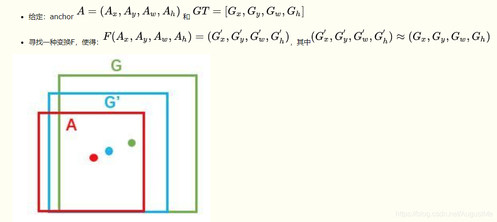
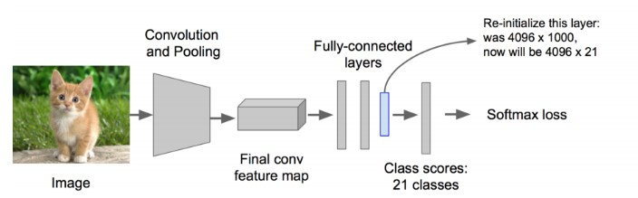
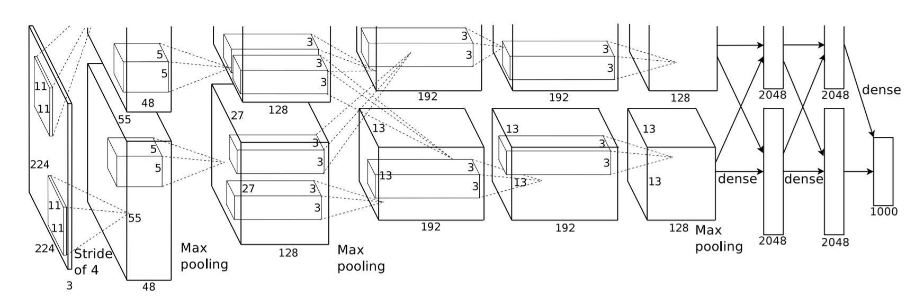
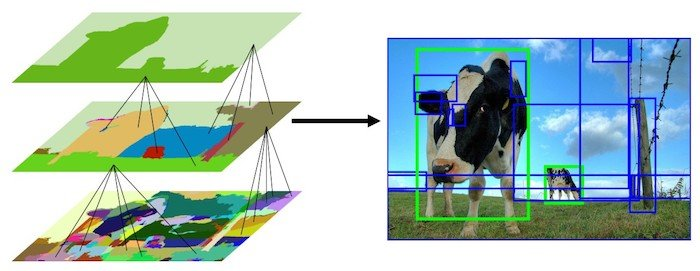
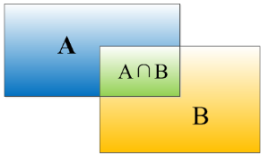
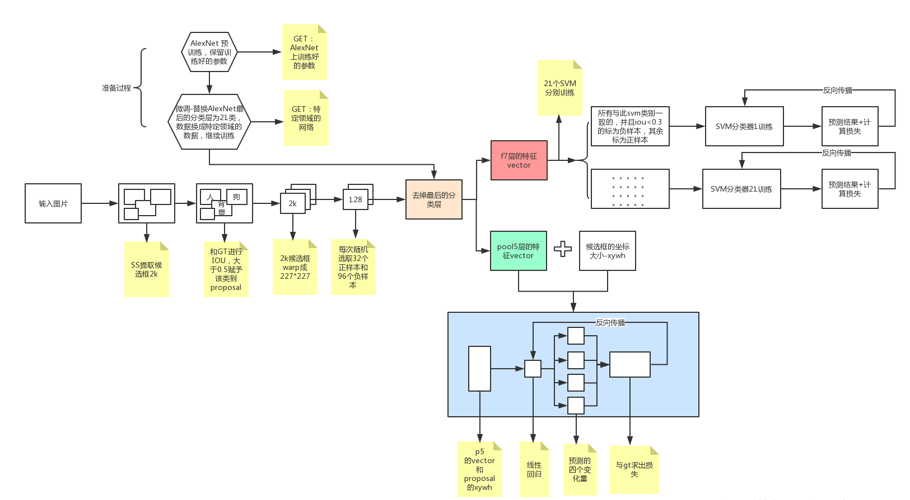
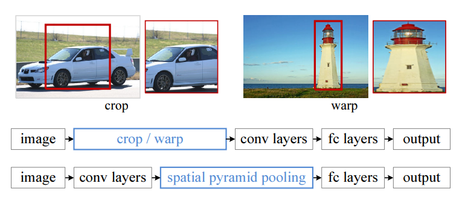
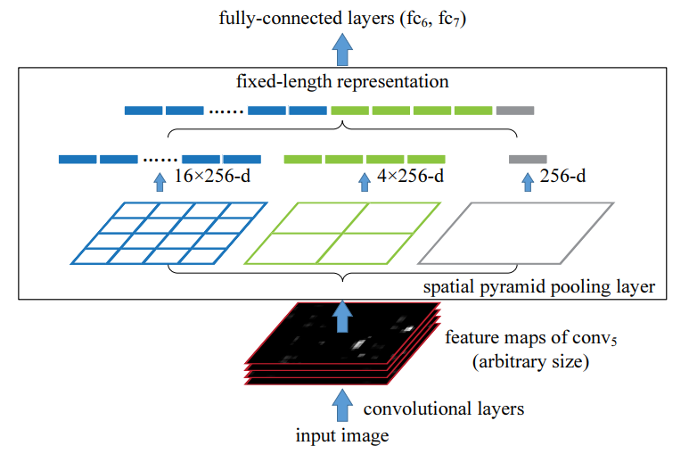

## R-CNN与SPPNet

### 目标检测—Overfeat模型

滑动窗口：暴力方法，从左到右、从上到下滑动窗口，利用分类标识目标

- 窗口宽高如何设置？—— 预先定义若干个宽高不同的窗口

绝大多数窗口中都不包含目标，增加了计算量以及误检测概率。

### 目标检测 — R-CNN

- 提出候选区域方法`Region Proposal Method`

#### 步骤

1. 找到目标中可能存在的目标候选区域`Region Proposal` （找到2000个候选区域）
2. 为了适应`AlexNet`，输入图片调整为 $227 \times 227$，输入到`AlexNet`中得到特征向量，得到 $2000 \times 4096$ 维矩阵
3. 将 $2000 \times 4096$ 经过$20$个不同类别的 `SVM` 分类器（$20$种分类），得到 $2000 \times 21$ 中类别矩阵
4. 分别对$2000\times 21$维举证中进行非极大值抑制，去除不好的、重叠度高的候选区域。
5. 修正候选框，`bbox`做回归微调

> 类别为$21$ ，其中目标类别为20，还有一个类别代表背景。

- AlexNet 结构

  

- 如何获取候选区域`ROI` 

  选择性搜索`SelectiveSearch`：先利用基于图的图像分割的方法得到小尺度的区域，然后一次次合并得到大的尺寸。考虑颜色、纹理、大小等特征。

  

- 非极大化抑制`NMS`

  - 筛选概率较小的候选区域 $( < 0.5 )$

  - 对于每个候选框找到自己对于的`Ground-truth bounding box`

  - 交并比`IOU`超过一定阈值，则保留得分最高的候选区域

    理想情况：每个`Ground-truth bounding box`对应一个候选区域

- 修正候选区域

  通过回归来修正筛选后的候选区域，使之回归与`Ground-truth bounding box`

  A 为候选框，G为目标真实位置框，让A与G做回归训练，修正位置参数，让A更加接近G

  

  

  

#### 评估指标

- 交并比 IoU

  
  $$
  IOU = {A \cap B \over A \cup B}
  $$
  
- 平均准确率 MAP(Mean Avg Precision)

  定义：多个分类任务的AP的平均值

  - TP: 真正例、FN:  假负例
  
  - RECALL：TP / ( TP + FN )
  
  - AP：平均精确度
  
  - mAP = 所有类别AP之和 \ 类别的总个数
  - 对于每个类别计算AP的值

#### 总结

过程：图片 $\rightarrow$ ROI   $\rightarrow$ 大小变换  $\rightarrow$ 卷积  $\rightarrow$ 特征向量  $\rightarrow$ SVM 分类  $\rightarrow$  BBox 回归 微调候选区域

缺点：

- 训练时间长、阶段多： 微调网络、训练SVM、训练BBox回归器
- 占用磁盘大
- 处理速度慢

改进：

- 减少卷积运算

#### 问题

1. NMS的过程描述、有何作用？
2. 说明候选框的修正过程
3. IoU以及 mAP 的计算过程

### 目标检测—SPPNet

> 1. `SelectiveSearch`：寻找候选区域 `Region Proposal`
>
> 2. `CNN`：生成整个图像的特征图
>
> 3. 将第1步中寻找的候选区域映射到第2步生成的特征图中去，得到多个候选区域的特征图
> 4. 将大小不一的候选区域的特征图映射成固定长度的特征向量
> 5. 

- 较少卷积计算

  

  `SPP` 即是 `Spatial Pyramid Pooling`

- 与`R-CNN`的区别

  - 先卷积得到一个`Feature Map`

  - 原图中通过`Selective Search`得到的候选区域直接映射到`Feature Map`的位置

    - 左上角的点：$x' = [x/S] + 1、y' = [y/S] + 1$
    - 右下角的点：$x' = [x/S] - 1、y' = [y/S] - 1$

    其中 $S$ 所有stride的乘积

    也就是说对于`Feature Map`的一个像素$(x',y')$，其实际感受野为：$(S\times x'，S\times y')$

  - 映射过来的候选区域的特征向量，经过`SPP`层输出固定大小的特征向量

#### SPP（Spatial Pyramid Pooling）

- 将特征图转化为固定大小的特征向量

SPP Layer 会将每一个候选区域分成 $1 \times 1、2 \times 3、4 \times 4$ 三张子图，每个子图的每个区域做 `Max-Pooling`，得到的特征图连接到一起就是 $(1 \times 1 +  2 \times 2 + 4 \times 4) \times 256 = 5376$ 种结果，交给全连接层做下一步处理。

#### 问题

- 训练仍然过慢，效率低
- 分阶段训练网络：候选区域的选择，训练CNN，训练SVM，训练BBox回归器，SPP-Net反向传播效率低

