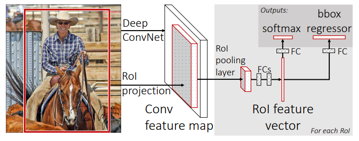
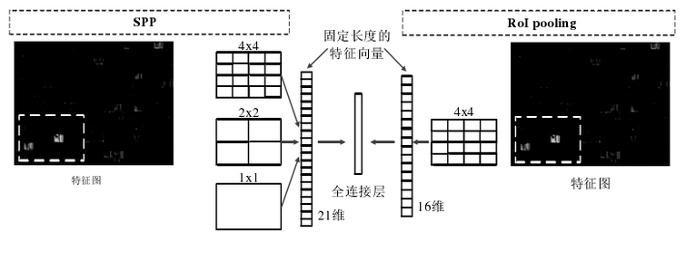

### Fast R-CNN

解决训练网络不统一的问题 —— RoI Pooling

#### 步骤

1. 将整张图片输入到一个卷积网络，得到整张图的`Feature Map`
2. 将`Selective Search`得到的结果`Region proposal`（RoI）映射到`Feature Map`中
3. `RoI Pooling Layer` 提取一个固定长度的特征向量（MaxPooling $7 \times 7$），每个特征会输入到一系列的全连接层，得到相应的RoI特征向量

   - 使用 `Softmax` 层进行分类，输入的类别有 K + 1 个，多加的一个为背景类 (没有使用SVM了)

   - 使用 `Bounding Box Regressor` 

     - 输出 K + 1 个类别的候选边界框回归参数$(d_x, d_y, d_w, d_h)$，共$(K + 1) \times 4$ 个节点

      $P_x, P_y, P_w, P_h$ 分别为候选框的中心$x、y$ 坐标和宽高

      $\hat{G_x}, \hat{G_y}, \hat{G_w}, \hat{G_h}$ 分别为最终预测的边界框的中心$x、y$ 坐标和宽高

     有
     $$
     \hat{G_x} = P_wd_x(P) + P_x \\
     \hat{G_y} = P_hd_y(P) + P_y \\
     \hat{G_w} = P_wexp{d_x(P)} \\
     \hat{G_h} = P_hexp{d_h(P)} \\
     $$
     

#### RoI Pooling

SPP 与 RoI Pooling 对比

- 减少时间并得到固定长度的向量
- 只使用一个 $4 \times 4$ 的空间盒数（减少参数计算量）

#### 多任务损失

分类：为 K + 1 路的 softmax 输出，使用 交叉熵损失

回归：为 4N 路输出的 Regressor，对于每个类别都会训练一个单独Regressor，使用平均绝对误差损失，即L1损失

#### 优缺点

- 训练比较统一：废弃了SVM和SPP-Net
- 使用`Selective Search`提取候选区域，没有实现真正意义上的端到端，操作也十分耗时

### 问题

RoI Pooling 的过程是什么？

- 根据原图与特征图的比例，将RoI映射到特征图对于的区域

