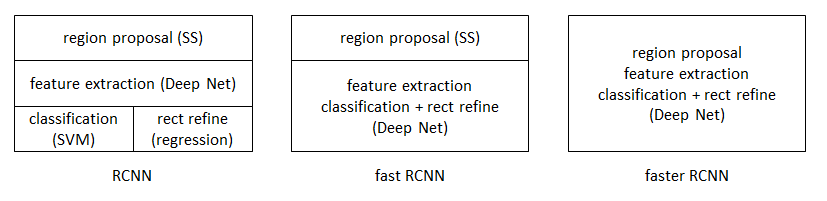

### Faster R-CNN

在 Faster R-CNN 种加入了一个提取边缘的神经网络，这就是说寻找候选框的工作可以交给神经网络来做了（原先是由`Selective Search`做的）。

这样，目标检测的四个步骤：候选区域的生成、特征提取、分类、位置调整，被统一到了一个深度网络框架之内。

`Faster R-CNN` 可以看作候选区域生成网络`RPN` + `Faste R-CNN`

#### RPN Region Proposal Network

替代了 `Selective Search`

- 用于生成候选区域`Region proposals`，称为 `Anchors`

  - 通过Softmax判断`Anchors`是否为背景（只检测是背景或者是目标两类）

    

    $CLS = [0.1, 0.9, 0.6, 0.4, 0.2, 0.8, ...]$ 每两个为一组，表示当前Anchor Box是背景或者目标的概率

    $REG = [D_x^1, D_y^1, D_w^1, D_h^1, D_x^2, D_y^2, D_w^2, D_h^2, ...]$ 每四个为一组，表达当前Anchor Box 的位置

    

  - 利用Bounding Box Regression 修正 Anchors 获取精准的 Proposals

    

RoI Pooling层则利用 proposals 从 feature maps 中提取 proposal feature 送入后续全连接和softmax网络作classification

- 对于**特征图**上的 $3 \times 3$的滑动窗口，计算滑动窗口中心点对应**原始图像**上的中心点，并计算出k个Anchor Box

  

  

#### 原理

RPN 网络的主要作用是得出比较准确的候选区域

- 用 $n \times n$ 的大小窗口去扫描特征图，每个窗口的位置会被映射到一个较低维度的向量，并为每个窗口考虑K种（论文中为9种）不同形状可能的参考窗口`Anchors`。

  

特征图大小为$W \times H$，则Anchors的个数为：$W \times H \times K$

- 2k scores 表示 k 和 Anchor Box 生成的 positive 和 negative 两个类别的概率
- 4k coordinates 表示 k 个Anchor Box 生成的位置信息$(x_{min}, y_{min}, x_{max}, y_{max})$
- 256-d：原论文种使用的ZF模型，输出的特征图通道数为256，**如果使用VGG则生成的通道数为512，本文中使用的是VGG，故特征图有512个通道。**
- RPN最终就是在原图尺度上，设置了密密麻麻的候选Anchor。然后用CNN去判断哪些Anchor是里面有目标的positive anchor，哪些是没目标的negative anchor。

经过RPN输出的

#### softmax判定positive与negative

原始图大小为$N \times M$，经过 VGG16 后，得到的特征图大小为 $W \times H = M/16 \times N/16$

对多通道图像做1x1卷积，其实就是将输入图像于每个通道乘以卷积系数后加在一起，即相当于把原图像中本来各个独立的通道“联通”在了一起。

经过

#### 对proposals进行bounding box regression

#### RoI pooling

#### Classification

#### 说明

1. 输入图片大小设置为 $800 \times 600$，经过VGG后，得到特征图大小为 $800/16 \times 600/16 = 50 \times 38$

   VGG 最后一个卷积层共有 512 个卷积核，得到输出特征图的通道数为 $512$

2. 设置 $50 \times 38 \times k$ 个Anchors，RPN 输出 $50 \times 38 \times 2k$ 个分类特征矩阵以及$50 \times 38 \times 4k$  个坐标回归矩阵

