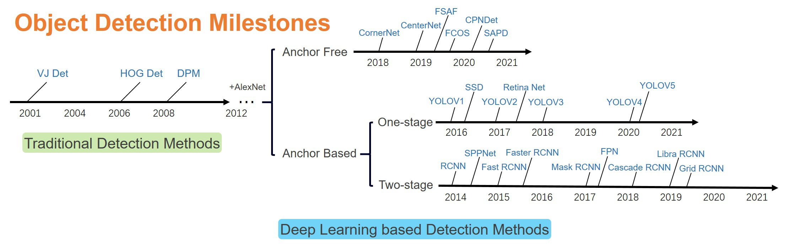
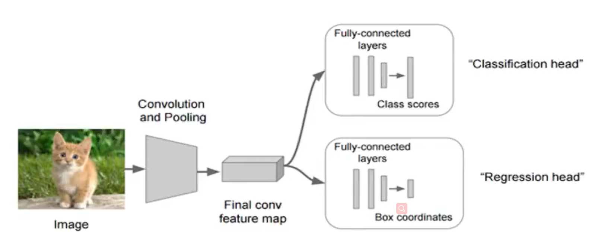
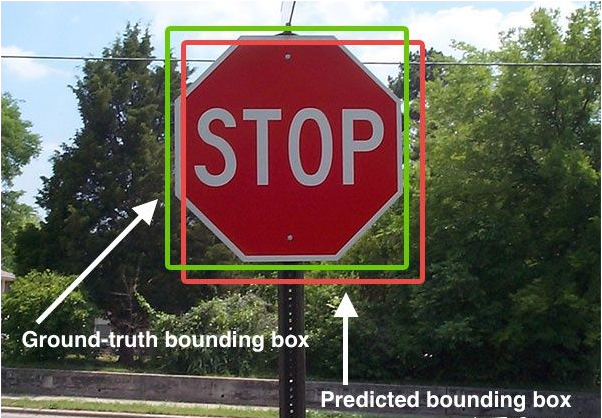

### 目标检测概述

#### 目标检测算法分类

#### 目标检测的任务

- 输入：图片

- 输出：

  - 物体的类别

  - 物体的位置：

    - $(x,y,w,h)$  ：$(x, y)$ 为物体中心点的位置
    -  $(x_{min}, y_{min}, x_{max}, y_{max})$ ：物体的左上角、右下角坐标

    

####  目标检测的简单思路

- 分类用于检测目标的类别，使用交叉熵损失
- 回归用于获取目标的位子信息，使用均方差损失`MSE` （$L2$）

##### Bounding Box

- Ground-truth bounding box：图片中目标真实位置
- Predicted bounding box：预测的目标位置

