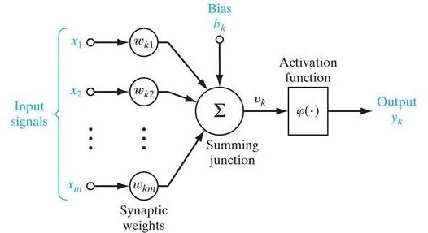
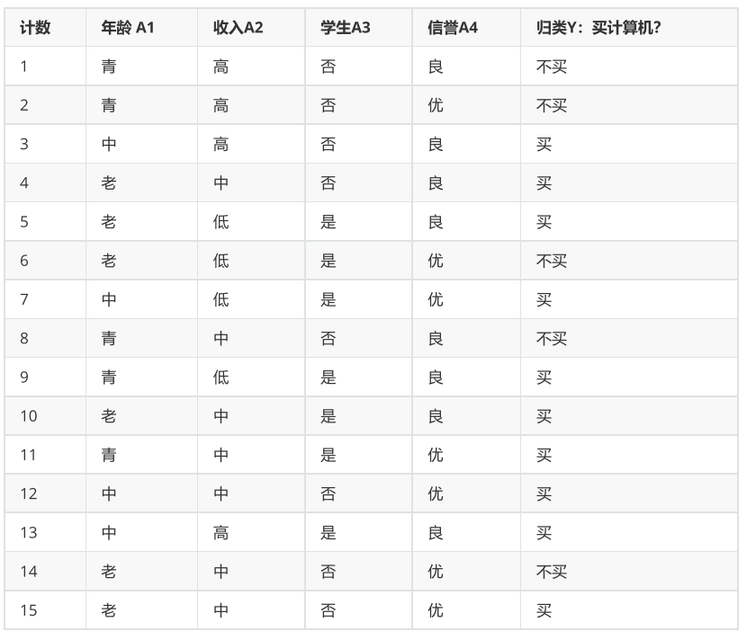
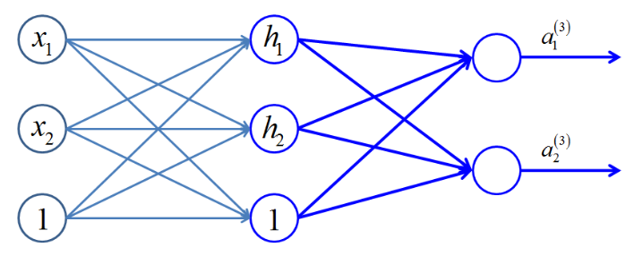
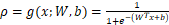

机器学习测试卷一

**一、基础知识（$2 \times 25$**）

1. 给定一个输入 $X$ 和决策函数 $f$ ，$X$ 对于的真实值为 $Y$ ，而决策函数得到的预测值为 $f(X)$，则可以定义一个损失函数 $L(Y, f(X))$ 来描述真实值和预测值之间的差异。 

   $0-1$ 损失定义为，$\_\_\_\_\_\_\_\_\_\_\_\_\_\_\_$，

   平方损失定义为$\_\_\_\_\_\_\_\_\_\_\_\_\_\_\_$，

   对数损失定义为$\_\_\_\_\_\_\_\_\_\_\_\_\_\_\_$。

2. 给定训练数据集$T=\{(x_1,y_1),(x_2,y_2),\ldots,(x_N,y_N)\}$，其中$x_i \in \mathcal{X} = R^n$，$y_i \in \mathcal{Y} = \{-1, +1\}$，$i=1,2,\ldots,N$；学习率$\eta (0 < \eta \leqslant 1)$；参数$w, b$。

   感知机模型 $f(x)= \_\_\_\_\_\_\_\_\_\_\_\_\_\_$  ，对于数据$(x_i,y_i)$为误分类点的判断依据为$\_\_\_\_\_\_\_\_\_\_\_\_\_\_\_$，使用`SGD`对参数进行更新，若$(x_i,y_i)$为误分类点，则参数$w、b$更新公式为：$w = \_\_\_\_\_\_\_\_\_\_、b = \_\_\_\_\_\_\_\_\_\_$。

3. 贝叶斯决策理论方法是统计模型决策中的一个基本方法，其基本思想是

   - 已知类条件概率密度参数表达式和$\_\_\_\_\_\_\_\_\_\_\_\_\_\_\_$
   - 利用贝叶斯公式转换成$\_\_\_\_\_\_\_\_\_\_\_\_\_\_\_$
   - 根据$\_\_\_\_\_\_\_\_\_\_\_\_\_\_\_$大小进行决策分类

4. 朴素贝叶斯法利用贝叶斯定理与学到的联合概率模型进行分类预测，输入$X = (x^{(1)}, x^{(2)}, ..., x^{(n)})$ ，$Y = \{c_1, c_2, ..., c_K\}$

   有在条件$X$的情况下其类别为$Y$的概率公式为：
   $$
   P(Y|X) = \_\_\_\_\_\_\_\_\_\_\_\_\_\_\_\_\_
   $$
   将输入$X$分到后验概率最大的类$y$的表达式为：
   $$
   y = \_\_\_\_\_\_\_\_\_\_\_\_\_\_\_\_\_\_
   $$

5. 决策树解决分类问题一般包含两个步骤：

   - 模型构建（归纳）：$\_\_\_\_\_\_\_\_\_\_\_\_\_\_\_\_\_\_$，建立分类模型 
   - 预测应用（推论）：根据分类模型，$\_\_\_\_\_\_\_\_\_\_\_\_\_\_\_\_\_\_$

6. 信息增益作为划分数据集的特征，存在偏向于$\_\_\_\_\_\_\_\_\_\_\_\_\_\_\_$的特征，所以可以使用信息增益比来划分，对于样本$D$，特征$A$，$A$对样本$D$的信息增益是$\_\_\_\_\_\_\_\_\_\_\_\_\_\_\_\_\_\_$，信息增益比是$\_\_\_\_\_\_\_\_\_\_\_\_\_\_\_\_\_\_$和$\_\_\_\_\_\_\_\_\_\_\_\_\_\_\_\_\_\_$的比值。

7. SMO算法是一种启发式算法，其基本思路是：如果所有变量的解都满足此最优化问题的KKT条件，那么这个最优化问题的解就得到了。因为KKT条件是该最优化问题的充分必要条件。SMO算法在每个子问题中选择$\_\_\_\_\_$ 个变量进行优化，且至少有一个不满足KKT条件，然后求解$\_\_\_\_\_\_$ 问题更新它们。

8. 集成学习包括两个基本步骤 

   - 首先根据数据集构造$\_\_\_\_\_\_\_\_\_\_\_\_\_\_\_$
   - 对弱学习器进行组合得到$\_\_\_\_\_\_\_\_\_\_\_\_\_\_\_$

9. 泛化误差指的是模型在$\_\_\_\_\_\_\_\_\_\_\_\_\_\_\_\_\_$ 上的误差，经验误差指的是模型在$\_\_\_\_\_\_\_\_\_\_\_\_\_\_\_\_\_$ 上的误差。

10. 有如下人工神经元模型

    

    激活函数`Activation function`$f$的作用是对神经元增加 $\_\_\_\_\_\_\_\_\_\_\_\_\_\_\_$。

    如Sigmoid函数，其导数值$f(x)' = \_\_\_\_\_\_\_\_\_\_\_\_\_\_\_\_\_$ （使用$f(x)$函数表示）。

**二、计算题（$2 \times 15$**）

1. 如下为某公司统计的数据表$D$

   使用ID3算法计算下面问题
   
   $(1)$ 计算样本$D$的信息熵$H(D)$
   
   $(2)$ 计算出各特征$A_i$对样本$D$的经验条件熵$H(A_i|D)$并计算出信息增益$G(A_i|D)$，其中 $i = 1,2,3,4$
   
   $(3)$ 画出决策树

2. 已知一个有训练数据集，其正例点是$x_1=(1,2)^T，x_2=(2,3)^T，x_2=(3,3)^T$,负例点是$x_4=(2,1)^T，x_5=(3, 2)^T$，请求出最大间隔分类超平面并给出分类决策函数以及支持向量。

**三、综合题（$2 \times 10$**）

1. 现有如图所示的神经网络模型，其中各神经元均使用 Sigmoid激活函数，假设当前网络的权重向量$W$取值为
   $$
   \begin{align}
   W &= (𝑤_{11}^{(1)},𝑤_{12}^{(1)},𝑤_{21}^{(1)},𝑤_{22}^{(1)},b_{1}^{(2)},b_{2}^{(2)},𝑤_{11}^{(2)},𝑤_{12}^{(2)},𝑤_{21}^{(2)},𝑤_{22}^{(2)},b_{1}^{(3)},b_{2}^{(3)})^T \\\\
   &= (0.2,03,0.4,0.5,0.3,0.3,0.7,0.5,0.8,0.3,0.5,0.5)^T
   \end{align}
   $$
   损失使用均方误差损失

   试用样本 $(X, y) = [(0.4,0.6), (0.6,0.6)]$ 完成对连接权重的一次更新。

   

2.  Logistic Regression如下式定义：，采用交叉熵损失训练W，b。请写出损失函数的表达式，并推导出损失函数对参数W和b的偏导数。
