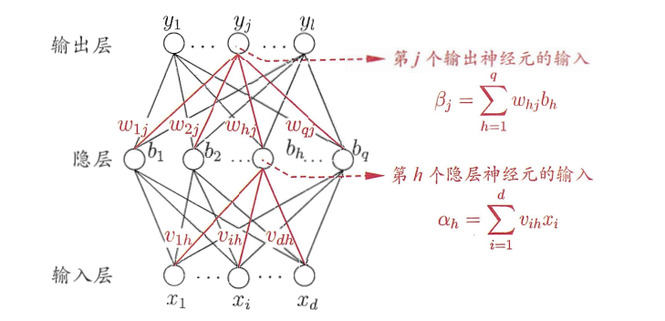

机器学习测试卷二

一、基础知识（$2 \times 25$）

1. 损失函数 $L(Y, f(X))$ 的期望风险`expected risk`$E_{exp}(f) = \_\_\_\_\_\_\_\_\_\_\_\_\_\_\_$，给定训练数据集 $T = \{ (x_1, y_1), (x_2, y_2), ..., (x_N, y_N) \}$，模型 $f(X)$ 关于该训练集的平均损失称为经验风险`empirical risk`，$E_{emp}(f) = \_\_\_\_\_\_\_\_\_\_\_\_\_\_\_$。根据大数定律当 $N \rightarrow \infty$ 时，有$\_\_\_\_\_\_\_\_\_\_\_\_\_\_\_$趋向于$\_\_\_\_\_\_\_\_\_\_\_\_\_\_\_$。

2. 贝叶斯方法的基本求解思路为：后验概率=$\_\_\_\_\_\_\_\_\_\_\_\_\_\_\_$ × 样本信息。

3. 构造决策树的关键：如何选择$\_\_\_\_\_\_\_\_\_\_\_\_\_\_\_$ ，可以使得结点所对应样本子集中的样本尽可能多地属于同一类别，即具有尽可能高的纯度。

4. 基尼系数`Gini Index`用来衡量数据的$\_\_\_\_\_\_\_\_\_\_\_\_\_$，表示从样本集中随机抽取两个样本，其标签不一样的概率，对于二分类问题，若样本属于第一个类别的概率为$p$，则概率分布的基尼指数为$Gini(p) = \_\_\_\_\_\_\_\_\_\_\_\_\_\_\_\_$。

5. `Sigmoid`函数表达式为$f(z) = \_\_\_\_\_\_\_\_\_\_\_\_\_\_\_\_\_$，且有$f(z)' = \_\_\_\_\_\_\_\_\_\_\_\_\_$。

6. 在AdaBoost算法中，权重更新公式
   $$
   w_{m+1}^{(i)} = {w_m^i \cdot {e^{-\alpha \cdot y_if_m(x_i)}} \over \sum_{j=1}^N w_m^j \cdot y_jf_m(x_j)}
   $$
   表明当$y_i = f_m(x_i)$，即弱分类器分类对第$i$个样本分类正确的时候，会适当的$\_\_\_\_\_$其权值，反之则$\_\_\_\_\_$其权值，这样也使得误分类样本在下一轮学习中起的作用会更大。
   
7. 假设𝐷中包含有𝑛个样本数据，自助采样对$D$进行$\_\_\_\_\_\_\_\_\_\_\_\_\_\_\_$的随机采样并将采样样本纳入训练集，对样本数据集𝐷进行多次自助采样就可以分别生成多个具有一定差异的训练样本子集𝐷1, 𝐷2,⋯, 𝐷𝐾,可分别通过对这些子集的训练构造出所需的弱学习器，下图为$\_\_\_\_\_\_\_\_\_$ 算法集成学习流程图，其就是通过自助采用来生成数据集，是一种并行化方法，而Boosting算法是一种$\_\_\_\_\_\_\_\_\_\_\_\_\_\_\_$方法。

   

8. 给定训练样本$X=(x_1, x_2, ..., x_N)^T$ ，模型$f(x_i) = W^Tx_i \ 其中 \ W = (w_1, w_2, ..., w_m, b)^T, x_i = (x_i^{(1)}, x_i^{(2)}, ..., x_i^{(m)}, 1)^T$ 对应标签$y = (y_1, y_2, ..., y_N)^T$，使用最小二乘法，即基于均方误差最小化有损失函数
   $$
   L(W) = {\sum_{i=1}^N}_{\_\_\_\_\_\_\_\_\_\_\_\_\_\_\_\_\_\_\_\_\_\_\_\_\_\_\_}
   $$
   使用矩阵表示有$L(W) = ||WX - y||^2\ = (WX - y)^T(WX - y)$，此时当$W = \_\_\_\_\_\_\_\_\_\_\_\_\_\_\_$ 时，损失函数值最小。

9. 对于大多数神经网络模型而言，其根本目的在于模拟适用于某个任务的$\_\_\_\_\_\_\_\_\_\_\_\_\_\_\_\_\_$ 。

10. 概念`concept`是指从样本空间 $\mathcal{X}$ 到标记空间 $\mathcal{Y}$ 的映射，它决定x的真实标记y。如果对于 $\forall (x, y)$ 均有 $c(x) = y$ ，则称 $c$ 为$\_\_\_\_\_\_\_\_\_\_\_\_\_\_\_\_\_$ 。给定学习算法$\mathcal{L}$，它所考虑的所有可能概念的集合称为“假设空间$\mathcal{H}$”，学习的过程可以视为 $\mathcal{L}$ 在 $\mathcal{H}$ 中进行搜索的过程。  若 $c \in \mathcal{H}$ ，即假设空间中存在假设能将所有的示例完全正确分开，则称该问题对学习算法 $\mathcal{L}$ 是$\_\_\_\_\_\_\_\_\_\_\_\_\_\_\_\_\_$。在实际中，我们希望学习算法 $\mathcal{L}$ 学到的模型 $h$ 能尽可能的接近 $c$。

11. 神经网络模型优化过程中一般要对数据进行归一化的原因是$\_\_\_\_\_\_\_\_\_\_\_\_\_\_\_\_\_\_\_\_\_\_\_\_\_\_\_\_\_\_\_\_\_\_$。

12. 支持向量机的学习策略是$\_\_\_\_\_\_\_\_\_\_\_\_\_\_\_\_\_$，可形式化为一 个求解凸二次规划(convex quadratic programming)的问题， 也等价于正则化的$\_\_\_\_\_\_\_\_\_\_\_\_\_\_\_\_\_$的最小化问题。

13. 基于划分的聚类算法主要通过样本数据之间的距离进行聚类操作，主要适合于对$\_\_\_\_\_\_\_\_\_\_\_\_\_\_\_\_\_$聚簇的聚类。

14. 主成分分析中可以把数据由少数主成分表示，对数据$\_\_\_\_\_\_\_\_\_\_\_\_\_\_\_\_\_$。

二、计算题（$2 \times 15$）

1. 已知一个有训练数据集，其正例点是$x_1=(3,3)^T，x_2=(4,3)^T$,负例点是$x_3=(1,1)^T$，请求出分类超平面并给出感知机模型（即分类决策函数）。

2. 给定含有五个样本的集合 $x_1 = (0, 2)^T，x_2 = (0, 0)^T，x_3 = (1, 0)^T，x_4 = (5, 0)^T，x_5 = (5, 2)^T$ 。

   $(1)$ 试使用 $k$ 均值聚类算法将样本聚到2个类别中。

   $(2)$ 请选用一个不同的初始聚类中心，得到的结果相同吗？

三、综合题（$2 \times 1$）

1. 在朴素贝叶斯法，后验概率最大等价于$0-1$损失函数时的期望风险最小化。

   $(1)$ 写出$0-1$ 损失函数、期望风险以及后验概率最大函数的表达式

   $(2)$ 通过计算证明题干中的结论 

2. 如下的多层神经网络，激活函数使用Sigmoid，对于输入`( xk,  yk)`

   

   - 写出均方误差`Ek`的表达式

   - 写出均方误差对第`j`层输出神经元的输入的偏导

   - 写出均方误差对第`h`个隐层神经元的输入的偏导

   - 给出
     $$
     \triangle w_{hj}、\triangle v_{ih}
     $$
     的更新方程
