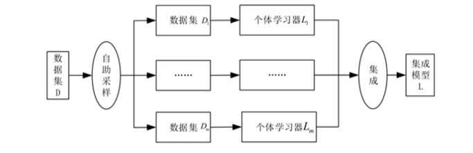
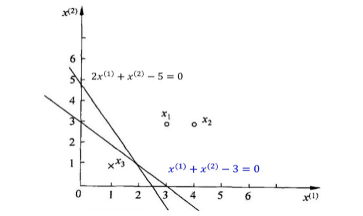

机器学习测试卷二

一、基础知识（$2 \times 25$）

1. 损失函数 $L(Y, f(X))$ 的期望风险`expected risk`$E_{exp}(f) = \_\_\_\_\_\_\_\_\_\_\_\_\_\_\_$，给定训练数据集 $T = \{ (x_1, y_1), (x_2, y_2), ..., (x_N, y_N) \}$，模型 $f(X)$ 关于该训练集的平均损失称为经验风险`empirical risk`，$E_{emp}(f) = \_\_\_\_\_\_\_\_\_\_\_\_\_\_\_$。根据大数定律当 $N \rightarrow \infty$ 时，有$\_\_\_\_\_\_\_\_\_\_\_\_\_\_\_$趋向于$\_\_\_\_\_\_\_\_\_\_\_\_\_\_\_$。

2. 基尼系数`Gini Index`用来衡量数据的$\_\_\_\_\_\_\_\_\_\_\_\_\_$，表示从样本集中随机抽取两个样本，其标签不一样的概率，对于二分类问题，若样本属于第一个类别的概率为$p$，则概率分布的基尼指数为$Gini(p) = \_\_\_\_\_\_\_\_\_\_\_\_\_\_\_\_$。

3. `Sigmoid`函数表达式为$f(z) = \_\_\_\_\_\_\_\_\_\_\_\_\_\_\_\_\_$，且有$f(z)' = \_\_\_\_\_\_\_\_\_\_\_\_\_$。

4. 假设𝐷中包含有𝑛个样本数据，自助采样对𝐷进行$\_\_\_\_\_\_\_\_\_\_\_\_\_\_\_$的随机采样并将采样样本纳入训练集，对样本数据集𝐷进行多次自助采样就可以分别生成多个具有一定差异的训练样本子集𝐷1, 𝐷2,⋯, 𝐷𝐾,可分别通过对这些子集的训练构造出所需的弱学习器，下图为$\_\_\_\_\_\_\_\_\_$ 算法集成学习流程图，其就是通过自助采用来生成数据集，是一种并行化方法，而Boosting算法是一种$\_\_\_\_\_\_\_\_\_\_\_\_\_\_\_$方法。

   

5. 

二、计算题（$2 \times 15$）

1. 已知一个有训练数据集，其正例点是$x_1=(3,3)^T，x_2=(4,3)^T$,负例点是$x_3=(1,1)^T$，请求出分类超平面并给出感知机模型（即分类决策函数）。

2. 给定含有五个样本的集合 $x_1 = (0, 2)^T，x_2 = (0, 0)^T，x_3 = (1, 0)^T，x_4 = (5, 0)^T，x_5 = (5, 2)^T$ 。

   $(1)$ 试使用 $k$ 均值聚类算法将样本聚到2个类别中。

   $(2)$ 请选用一个不同的初始聚类中心，得到的结果相同吗？

三、综合题（$2 \times 1$）

1. 在朴素贝叶斯法，后验概率最大等价于$0-1$损失函数时的期望风险最小化。

   $(1)$ 写出$0-1$ 损失函数、期望风险以及后验概率最大函数的表达式

   $(2)$ 通过计算证明题干中的结论 

