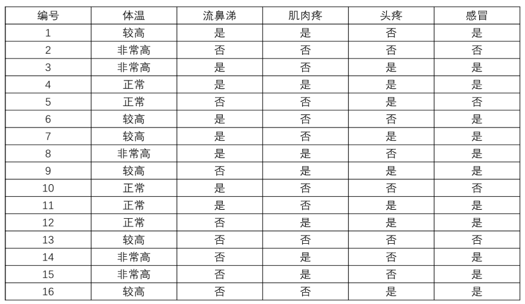

机器学习测试卷三

**一、基础知识（$2 \times 25$）**

1. 正则化有如下的一般形式
   $$
   \min_{f \in \mathcal{F}} {\frac{1}{N}}\sum_{i = 1}^{N}L(y_i, f(x_i)) + \lambda J(f) \quad \lambda > 0
   $$
   其中 $\lambda J(f)$ 为正则化项，$J(f)$ 与模型的复杂度呈$\_\_\_\_\_\_\_$相关，$\lambda$ 为调整经验风险与$\_\_\_\_\_\_\_\_\_\_\_\_\_\_\_$之间关系的系数。

2. $L_1$ 范数为 $\lambda ||w||_1$ （各参数绝对值之和），其倾向于将各参数调整为 $0$，故可产生稀疏权值矩阵，一般用于$\_\_\_\_\_\_\_\_\_\_\_\_\_\_\_$。

   $L_2$ 范数为 $\lambda ||w||_2^2$，（各参数求平方和后求平方根），因为要进行开方操作，故其主要影响绝对值大的参数，一般用于$\_\_\_\_\_\_\_\_\_\_\_\_\_\_\_$。

3. 假设有$N$种可能的类别标记,即 $y = \{c_1, c_2, ..., c_N\}$，$\lambda_{i,j}$是将一个真实标记为 $c_j$ 的样本误分类为 $c_i$ 所产生的损失。基于后验概率$P\{c_i | X\}$可获得将样本$X$分类为$C_i$所产生的期望损失（expected loss），即在样本上的 “条件风险”（conditional risk）定义为
   $$
   R(c_i | X) = \_\_\_\_\_\_\_\_\_\_\_\_\_\_\_
   $$
   
4. “信息熵”是度量样本集合纯度最常用的一种指标，假定当前样本集合D中第k类样本所占的比为$p_k$，类别数为$K$ ，则D的信息熵定义为
   $$
   H(D) = \_\_\_\_\_\_\_\_\_\_\_\_\_\_\_
   $$
   $H(D)$的值越小，则D的纯度越高。

5. 分类问题中，假设有$D$个样本$K$个类，样本点属于第$k$个类的概率为$p_k$，第$k$个类的个数记为$|D_k|$

   则概率分布的基尼指数为$Gini(p) = \_\_\_\_\_\_\_\_\_\_\_\_\_\_\_\_\_$

    对于样本集合$D$的基尼指数为$Gini(D) = \_\_\_\_\_\_\_\_\_\_\_\_\_\_\_$。

6. 集成模型泛化性能的提高的两个基本思路分别为：即降低个体学习器的$\_\_\_\_\_\_\_\_\_\_\_\_\_\_\_\_\_$和提高$\_\_\_\_\_\_\_\_\_\_\_\_\_\_\_\_\_$。

7. 在AdaBoost算法中，假设输入的是二分类的训练数据集 $T = \{(x_1, y_1), (x_2, y_2), ..., (x_N, y_N)\}$ ，初始化时，各个训练数据的权值$w_{1i}， i=1,2,...,N$设置为$\_\_\_\_\_$，循环到$m$次时，各个训练数据的权值为$w_{mi}$，对于第$m$个基分类器$G_m(x)$在训练数据集上的分类误差率为
   $$
   e_m = \sum_{i=1}^Nw_{mi}I(G_m(x_i) \neq y_i)
   $$
   则$G_m(x)$的系数$\alpha_m$为 $\_\_\_\_\_\_\_\_\_\_\_\_\_\_\_\_\_$ ，由此公式可知当 $e_m = {1 \over 2}$ 时，处于基本瞎猜状态，对应的系数$\alpha_m = 0$。

   最终将训练得到的$M$个若分类器$G_m, \quad m =1.,2,3...,M$集成一个强分类器$G(X) = sign(\_\_\_\_\_\_\_\_\_\_\_\_\_\_\_\_\_)$ 。

8. 岭回归的损失函数为
   $$
   L(W) = ||WX - y||^2 + \lambda||w||^2
   $$
   在线性回归模型损失函数上增加一个针对 $w$ 的范数惩罚函数，通过对目标函数做$\_\_\_\_\_\_\_\_\_\_\_\_\_\_\_\_\_$，来防止$w$过大。

9. 梯度消失问题的应对策略有：$\_\_\_\_\_\_\_\_\_\_\_\_\_\_\_\_\_$，$\_\_\_\_\_\_\_\_\_\_\_\_\_\_\_\_\_$，$\_\_\_\_\_\_\_\_\_\_\_\_\_\_\_\_\_$。

10. 线性可分SVM的硬间隔最大化需要优化的问题是
    $$
    {\max_{w, b}}_{\_\_\_\_\_\_\_\_\_\_\_\_\_\_\_\_\_\_\_\_\_\_\_\_\_} \\\\
    s.t. \_\_\_\_\_\_\_\_\_\_\_\_\_\_\_\_\_\_
    $$
    构造并求解约束最优化问题，求得$w^*$和$b^*$，则
    $$
    分离超平面 = _{\_\_\_\_\_\_\_\_\_\_\_\_\_\_\_\_\_\_} \\
    分类决策函数 f(x_i) = \_\_\_\_\_\_\_\_\_\_\_\_\_\_\_\_\_\_\_
    $$
    
11. 在VC维中，增长函数用以表示假设空间对m个示例所能赋予标记的最大可能结果数，利用增长函数来估计经验误差与泛化误差之间的关系，增长函数表述了$\_\_\_\_\_\_\_\_\_\_\_\_\_\_\_\_\_$的表示能力，反映出其复杂度。

12. 核函数的价值在于它虽然也是将特征进行从低维到高维的转换，但核函数的本质是在$\_\_\_\_\_\_\_\_\_\_\_\_\_\_\_\_\_\_\_\_\_\_\_\_\_\_\_\_\_\_\_\_\_\_$，也就避免了直接在高维空间中的复杂计算。

13. 任意选择的一组𝑘 个线性无关 𝑚 维向量，作为基向量构成变换矩阵$W$，将数据集𝐷中样本数据降至 $\_\_\_\_\_\_\_\_\_\_$ 维

    若 𝑘 = 𝑚，则转换后数据保留了原数据的全部信息，若 𝑘 = 0，则相当于完全不展示原数据的信息。

    在确定 𝑘 的具体取值时，通常会考虑不同 𝑘 值可保留方差的百分比并称这种分量方差占总方差的百分比为该分量对$\_\_\_\_\_\_\_\_\_\_\_\_\_\_\_\_\_$。

**二、计算题（$2 \times 15$）**

1. 某抽奖游戏使用三个外观一致的碗和三张抽奖劵，其中两张1元劵和一张1000元劵。游戏主持人分别用每个碗盖住一张劵且不让抽奖者知道每个碗盖的是几元劵，在抽奖者选定一个碗之后翻开剩下两个碗中的一个，使得翻开的碗盖的是1元劵。抽奖者如何选择才能以较高的概率获得1000元劵？

2. 支持向量机的最优化问题表达为
   $$
   \begin{align}
   
   \min_{w,b} \quad &f(w) = \frac{1}{2} ||w|| ^2  \\
   s.t. \quad &y_i(w^Tx_i + b) \geq 1, \quad i=1, 2, 3, ..., N
   
   \end{align}
   $$
   $(1)$ 设拉格朗日乘子为$\alpha = (\alpha_1, \alpha_2, ..., \alpha_l)$，写出该问题的拉格朗日函数

   $(2)$ 写出该问题的对偶问题

   $(3)$  若 $\alpha^* = (\alpha_1^*, \alpha_2^*, ..., \alpha_l^*)$ 是对偶问题的解，则原问题的解 $w*、b^*$ 、分类决策函数 $g(x)$ 分别为？。

**三、综合题（$2 \times 10$）**

1. 下表是一个感冒诊断样本数据集，试用该数据集构造一颗作为随机森林弱学习器的 CART 决策树，在确定某结点的划分属性时，若该结点所对应属性集合具有𝑚个特征，则规定从中随机选择$s = log_2m$ 个属性计算用于确定划分属性的基尼指数。

   

2. 给定如下表的训练数据。假设弱分类器由 $x < v$ 或者 $x > v$ 产生，其阈值 $v$ 使该分类器在训练数据集上的误差最低。试着使用 AdaBoost 算法学习一个强分类器。

   | 序号 |  1   |  2   | 3    |  4   |  5   |  6   |  7   |  8   |  9   |  10  |
   | :--: | :--: | :--: | ---- | :--: | :--: | :--: | :--: | :--: | :--: | :--: |
   | $x$  |  0   |  1   | 2    |  3   |  4   |  5   |  6   |  7   |  8   |  9   |
   | $y$  |  1   |  1   | 1    |  -1  |  -1  |  -1  |  1   |  1   |  1   |  -1  |
