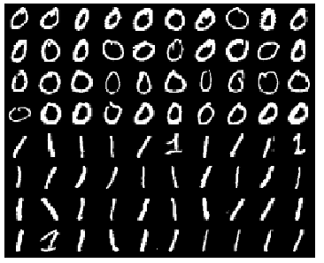
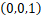
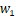
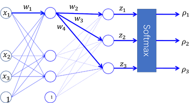

机器学习测试卷四

**一、基础知识（$2 \times 25$）**

1. 泛化能力指的是模型$\_\_\_\_\_\_\_\_\_\_\_\_\_\_\_$。

   泛化误差定义如下
   $$
   \begin{align}
   R_{exp} (\hat{f}) &= E_p[L(Y, \hat{f}(X))] \\\\
   		&= \int_{\mathcal{X} \times \mathcal{Y}} L(y, \hat{f}(x)) \times P(x, y)\ dxdy
   \end{align}
   $$
   其中$\hat{f}(X)$表示上面的 **^** 当前的模型是通过学习得到的。

   当使用平方损失时，泛化误差的表达式为$\_\_\_\_\_\_\_\_\_\_\_\_\_\_\_$。

   随着模型容量的增加，泛化误差$\_\_\_\_\_\_\_\_\_\_\_\_\_\_\_$，偏差$\_\_\_\_\_\_\_\_\_\_\_\_\_\_\_$，方差却组件增大，这是因为$\_\_\_\_\_\_\_\_\_\_\_\_\_\_\_\_\_\_\_\_\_\_\_\_\_\_$。

2. 使用贝叶斯判定准则来最小化决策风险，首先要获得后验概率，对此有两种方式：$\_\_\_\_\_\_\_\_\_\_\_\_\_\_\_$ （如：决策树、BP神经网络、支持向量机） 和 $\_\_\_\_\_\_\_\_\_\_\_\_\_\_\_$ （如：朴素贝叶斯）。

3. 朴素贝叶斯法对条件概率分布作了条件独立性的假设。由于这是一个较强的假设，朴素贝叶斯法也由此得名。具体地，条件独立性假设是：
   $$
   \begin{aligned}
   P(X&=x | Y=c_{k} )=P\left(X^{(1)}=x^{(1)}, \cdots, X^{(n)}=x^{(n)} | Y=c_{k}\right) \\ &={\prod_{j=1}^{n}}_{\_\_\_\_\_\_\_\_\_\_\_\_\_\_\_\_\_\_\_\_\_\_\_\_\_\_\_\_}
   \end{aligned}
   $$

4. 当前样本集合$D$中第$k$类所占的比例为$p_k \quad k = 1, 2, ..., K$，则样本$D$的信息熵定为为
   $$
   H(D) =_{\ \_\_\_\_\_\_\_\_\_\_\_\_\_\_\_\_\_\_\_\_}
   $$

5. 在Adaboost算法中，假设输入的是二分类的训练数据集 $T = \{(x_1, y_1), (x_2, y_2), ..., (x_N, y_N)\}$ ，在训练样本集$T$上学习到的第$m$个弱学习器$f_m$，且在当前情况下权重分布为$D_m = (w_m^{(1)}, w_m^{(2)}, ..., w_m^{(N)})$，其分类错误率$e_m = \sum_{j=1}^{N} w_{m}^{(j)}\times I(f_m(x_j) \neq y_j)$ ，则弱学习器$f_m$的权重$\alpha_m = \_\_\_\_\_\_\_\_\_\_\_\_\_\_\_$，更新后的训练样本$T$的第$i$个数据权重$w_{m+1}^{(i)} = \_\_\_\_\_\_\_\_\_\_\_\_\_\_\_$ 。

6. CART算法(`classification and regression tree algorithm`)的假设决策树是$\_\_\_\_\_\_\_\_\_\_$，其分类树使用$\_\_\_\_\_\_\_\_\_$最小化准则进行特征选择。

7. 由$\_\_\_\_\_\_\_\_\_$作为弱学习器组合而成的森林模型为随机森林模型，通常简称为随机森林。

8. 使用逻辑回归模型实现手写体图像数字0和1的识别 （图像大小均是28*28），并对学习结果进行可视

   输入一幅图像，产生0和1的识别结果，这是图像$\_\_\_\_\_\_\_\_\_\_$问题

   使用简单的像素值组成的向量作为图像的特征 $x$，由于图像大小是 28*28，因此特征的维度是$\_\_\_\_\_\_\_\_\_\_$

   一共有$N = 80$个训练样本，包括40个正样本(y=1)和40个负样本(y=0)，则我们可以通过逻辑回归算法实现该二分类问，有
   $$
   \begin{align}
   & P(y=0 | x) =_{\_\_\_\_\_\_\_\_\_\_\_\_\_\_\_\_\_\_\_\_} \\\\
   & P(y=1 | x) =_{\_\_\_\_\_\_\_\_\_\_\_\_\_\_\_\_\_\_\_\_} \\\\
   & P(y | x) =[_{\_\_\_\_\_\_\_\_\_\_\_\_\_\_\_\_\_\_\_\_}]^y \cdot [_{\_\_\_\_\_\_\_\_\_\_\_\_\_\_\_\_\_\_\_\_}]^{1-y} \\\\
   \end{align}
   $$
   使用交叉熵损失，知损失函数$L(w,b,x,y) = \_\_\_\_\_\_\_\_\_\_\_\_\_\_\_\_\_\_\_\_\_\_\_\_\_\_\_\_\_\_\_\_$ 。（使用 $w, b, x, y$表示）

9. 样本中有$10$个桃子，其中成熟的有6个，剩下的未成熟，则样本的基尼指数为$\_\_\_\_\_\_\_\_\_$。

   经过测量并统计

   - 以甜度是否大于0.2进行划分$D_1、D_2$两个部分，$D_1$中成熟的有6个，1个未成熟，$D_2$中只有3个未成熟的。
   - 以硬度进行划分为$D_1、D_2$两个部分，$D_1$中成熟的有4个，2个未成熟，$D_2$中有2个成熟的，2个未成熟的。

   则在甜度这一特征的条件下，样本$D$的基尼指数为$\_\_\_\_\_\_\_\_\_\_\_$。

   则在硬度这一特征的条件下，样本$D$的基尼指数为$\_\_\_\_\_\_\_\_\_\_\_$。

   这两个特征中用于划分数据集最优的为$\_\_\_\_\_\_\_\_\_\_\_$。

10. 在VC维中，尽管假设空间$\mathcal{H}$可能包含无穷多个假设, 但是其对样本D中示例赋予标记的可能结果是有限的: 在二分类问题中，对于m个示例，最多有$\_\_\_\_$个可能结果。

**二、计算题（$2 \times 15$）**

1. 已知一个有训练数据集，其正例点是$x_1=(3,3)^T，x_2=(4,3)^T$,负例点是$x_3=(1,1)^T$，求线性可分支持向量机，写出分类超平面和分类决策函数。

2. 给定如下表的训练数据。假设弱分类器由 $x < v$ 或者 $x > v$ 产生，其阈值 $v$ 使该分类器在训练数据集上的误差最低。试着使用 AdaBoost 算法学习一个强分类器。

   | 序号 |  1   |  2   | 3    |  4   |  5   |  6   |  7   |  8   |  9   |  10  |
   | :--: | :--: | :--: | ---- | :--: | :--: | :--: | :--: | :--: | :--: | :--: |
   | $x$  |  0   |  1   | 2    |  3   |  4   |  5   |  6   |  7   |  8   |  9   |
   | $y$  |  1   |  1   | 1    |  -1  |  -1  |  -1  |  1   |  1   |  1   |  -1  |

**三、综合题（$2 \times 10$）**

1. 假设$f(x)、g_i(x)、h_j(x)$是定义在$R^n$上的连续可微函数。考虑约束最优化问题
   $$
   \begin{align}
   & \min_{x \in R^n} f(x) \\\\
   s.t 
   & \quad g_i(x) \leq 0, \quad i = 1, 2, 3, ... K \\
   & \quad h_j(x) = 0, \quad j = 1, 2, 3, ... L \\
   
   \end{align}
   $$
   称此约束最优化问题为原始最优化问题或原始问题`Prime Problem`

   引入广义拉格朗日函数
   $$
   L(x, \alpha, \beta) = f(x) + \sum_{i=1}^{K} \alpha_ig_i(x) + \sum_{j=1}^{L}\beta_jh_j(x)
   $$
   其中$\alpha_i、\beta_j$为拉格朗日乘子，且$\alpha_i \geq 0$ 。

   令
   $$
   \theta_P(x) = \max_{\alpha, \beta : \alpha_i \geq 0} L(x,\ \alpha,\ \beta)
   $$
   再令
   $$
   \theta_D(\alpha, \beta) = \min_{x} L(x,\ \alpha,\ \beta)
   $$
   若 $x^*$ 是 $\min_x \theta_P(x)$  的解，$\alpha^*、\beta^* $ 是 $\max_{\alpha, \beta : \alpha_i \geq 0} \theta_D(x)$ （对偶问题`Dual Problem`）的解，回答下面的问题

   $(1)$ 说明为什么原始问题`Prime Problem`等价于 $\min_x \theta_P(x)$ 。

   $(2)$ 证明 $\theta_P(x^*) \geq \theta_D(\alpha^*,\ \beta^*)$。

   $(3)$ 若 $(2)$ 中的等号成立，即 $\theta_P(x^*) = \theta_D(\alpha^*,\ \beta^*)$，$x^*、\alpha^* 、\beta^*$ 需要满足的条件有哪些？

   

2. 下面是一个单隐层神经网络，输出层是一个3-Way Softmax，假设某个样本的真实类别的One-hot向量为，激活函数为Sigmid函数，采用交叉熵损失，请用BP算法，推导出该样本上的损失相对于图中参数的偏导数。图中表示对应连接上的权值参数， 表示输出层神经元的净响应。

