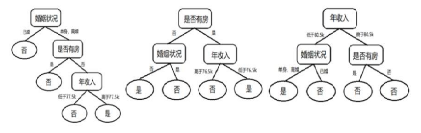
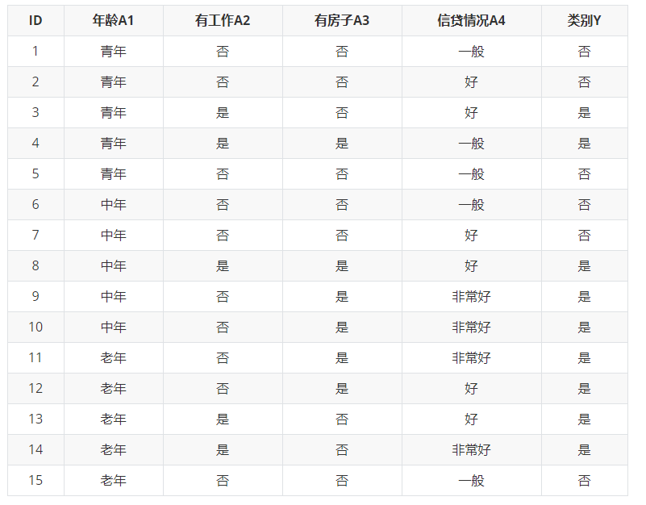

机器学习测试卷五

**一、基础知识（$2 \times 25$）**

1. 过拟合指的是同时拟合训练样本的$\_\_\_\_\_\_\_\_\_\_\_\_\_\_\_$和$\_\_\_\_\_\_\_\_\_\_\_\_\_\_\_$（即噪声）。

   欠拟合指的是未能充分拟合训练样本共性特征造成模型$\_\_\_\_\_\_\_\_\_\_\_\_\_\_\_$较大而导致模型泛化能力较弱。

2. 统计学习方法的三要素分别是$\_\_\_\_\_\_\_\_\_\_\_\_\_\_\_$、$\_\_\_\_\_\_\_\_\_\_\_\_\_\_\_$、$\_\_\_\_\_\_\_\_\_\_\_\_\_\_\_$。

3. EM (Expectation-Maximization)算法是常用的估计参数隐变量的利器  

   - 当参数 $\theta$ 已知 $\rightarrow$  $\_\_\_\_\_\_\_\_\_\_\_\_\_\_\_\_\_\_\_\_\_\_\_\_\_\_\_\_\_\_$(E步) 
   - 当 $Z$ 已知 $\rightarrow$  $\_\_\_\_\_\_\_\_\_\_\_\_\_\_\_\_\_\_\_\_\_\_\_\_\_\_\_\_\_\_$(M步)

   以初始值$\theta = \theta^0$为起点，可迭代上面步骤直至收敛。

4. ID3决策树学习算法[Quinlan, 1986]以$\_\_\_\_\_\_\_\_\_\_\_\_\_$为准则来选择划分属性，该准则对可取值数目$\_\_\_\_\_\_\_\_\_\_\_\_\_$的属性有所偏好。

   C4.5 [Quinlan, 1993]使用了一个启发式，以$\_\_\_\_\_\_\_\_\_\_\_\_\_$为准则来选择划分属性，该准则对可取值数目$\_\_\_\_\_\_\_\_\_\_\_\_\_$的属性有所偏好。

5. 样本集合$D$根据特征$A$的取值可被划分成$D_1、D_2$两部分，则在该特征的条件下，$D$的基尼指数被定义为
   $$
   Gini(D, A) = \_\_\_\_\_\_\_\_\_\_\_\_\_\_\_
   $$
   $Gini(D, A)$表示经过$A$的分割后$D$的不确定性，这二者之间呈$\_\_\_\_$相关。

6. 如下三棵决策树构成的随机森林用于预测客户是否可能会拖欠贷款

   

   对于输入样本 $X = {婚姻状况 = 单身，是否有房 = 有，年收入 = 67.2k}$，图所示随机森林模型对该样本的 预测输出应为$\_\_\_\_\_\_\_\_\_\_\_\_\_$ 。

7. 在AdaBoost算法中，假设输入的是二分类的训练数据集 $T = \{(x_1, y_1), (x_2, y_2), ..., (x_N, y_N)\}$ ，循环到$m$次时，各个训练数据的权值为$w_{mi}$，对于第$m$个基分类器$G_m(x)$在训练数据集上的分类误差率为
   $$
   e_m = {\sum_{i=1}^N}_{\_\_\_\_\_\_\_\_\_\_\_\_\_\_\_\_\_\_\_\_\_\_\_\_\_\_\_\_\_\_\_\_\_\_}
   $$
   则$G_m(x)$的系数$\alpha_m$为 $\_\_\_\_\_\_\_\_\_\_\_\_\_\_\_\_\_$ ，由此公式可知当 $e_m = {1 \over 2}$ 时，处于基本瞎猜状态，对应的系数$\alpha_m = \_\_\_\_$ 。
   
8. MLP模型中隐含层的层数为一层的神经网络称为$\_\_\_\_\_\_\_\_\_\_\_\_\_$ 。

9. 对于过于复杂的函数，难免会存在多个方向上梯度取值 均为0的非最优点，如局部最小值点和鞍点等。局部最优问题的应对策略有$\_\_\_\_\_\_\_\_\_\_\_\_\_\_\_\_\_$，$\_\_\_\_\_\_\_\_\_\_\_\_\_\_\_\_\_$，$\_\_\_\_\_\_\_\_\_\_\_\_\_\_\_\_\_$等。

10. 主成分分析中，首先对给定数据进行$\_\_\_\_\_\_\_\_\_\_\_\_\_$，使得数据 每一变量的平均值为0，方差为1

    - 之后对数据进行$\_\_\_\_\_\_\_\_\_\_\_\_\_$，原来由线性相关变量表示的数据，变成由若干个线性无关的新变量表示的数据
    - 新变量是可能的正交变换中变量的方差的和（信息保 存）最大的，方差表示在新变量上信息的大小
    - 可以用$\_\_\_\_\_\_\_\_\_\_\_\_\_$近似地表示原始数据，发现数据的基本结构

**二、计算题（$2 \times 15$）**

1. 如下为贷款申请样本$D$的数据表

   使用C4.5算法计算下面问题
   
   $(1)$ 计算各特征$A_{1-4}$对数据集$D$的经验条件熵$(D|A_i)$。
   
   $(2)$ 计算数据集$D$关于各特征$A_{1-4}$的熵$H_{A_i}(D)$。
   
   $(3)$ 计算各特征$A_{1-4}$对数据集$D$的信息增益比$G_R(D, A_i)$。
   
   
   
   
   
   
   
   
   
   

   

   

1. 在上题的数据集中

   $(1)$ 计算在信贷情况这一特征下，数据集$D$的基尼指数。 

   $(2)$ 第一次选择有无房子为最优切分点后，设没有房子的数据集为$D_1$，计算在年龄这一特征下，数据集$D_1$的基尼指数。

  

**三、综合题（$2 \times 10$）**

1. 某公司招聘职员考查身体、业务能力、发展潜力这3项。身体分为合格1、不合格0两级，业务能力和发展潜力分为上1、中2、下3三级。分类为合格1 、不合格-1两类。已知10个人的数据，如下表所示。假设弱分类器为决策树桩。试用 AdaBoost 算法学习一个强分类器。

   |      |  1   |  2   |  3   |  4   |  5   |  6   |  7   |  8   |  9   |  10  |
   | :--: | :--: | :--: | :--: | :--: | :--: | :--: | :--: | :--: | :--: | :--: |
   | 身体 |  0   |  0   |  1   |  1   |  1   |  0   |  1   |  1   |  1   |  0   |
   | 业务 |  1   |  3   |  2   |  1   |  2   |  1   |  1   |  1   |  3   |  2   |
   | 潜力 |  3   |  1   |  2   |  3   |  3   |  2   |  2   |  1   |  1   |  1   |
   | 分类 |  -1  |  -1  |  -1  |  -1  |  -1  |  -1  |  1   |  1   |  -1  |  -1  |

2. 回答以下几个问题

   $(1)$ 结合泛化误差谈谈方差和偏差的意义。

   $(2)$ SVM中核函数的本质是什么？

   $(3)$ 写出信息熵、信息增益、信息增益率以及基尼系数的计算公式，并说明其意义。

   $(4)$ 写出在二分类情况下逻辑回归的损失函数。

   $(5)$ 梯度消失以及局部最优问题的原因以及有何应对策略？

