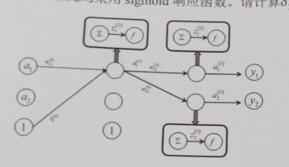

计算机视觉测试卷一

> - [x] 什么是计算机视觉 • Y=F(X),通过图像理解世界 • 计算机视觉与图像处理的关系
> - [x] 图像识别问题的定义 • 𝑌 = 𝐹 𝑋 ，𝑌 ∈ {1,2, … , 𝐾} • 自底向上方法的一般流程：特征提取与特征分类
> - [ ] 词袋模型 • 什么是视觉单词？ • 视觉词袋模型如何表示图像？ • 如何获取视觉词典？ • 词袋模型的特点。
> - [ ] 神经元模型 • 线性聚合，非线性变换
> - [ ] 几种典型的DCNN的结构及其设计思想 • VGG, GoogLeNet, ResNet
> - [ ] 机器学习的基本概念 • 数据、算法、假设空间 • 过拟合、欠拟合
> - [ ] 目标检测问题的定义 • 目标定位，目标检测
> - [ ] 性能评价 • FP, TP, FN, TPR, FPR, AP • AP与nms阈值以及得分阈值的关系
> - [ ] 图像分割问题定义
> - [ ] 问题定义 • 目标描述模型（表观模型） • 目标运动模型 • 预测+矫正
> - [ ] Generative Adersarial Network • 一般原理及其训练算法 • GAN的各种应用
> - [ ] Attention • Recurrent Attention Model • Soft Attention • Self-Attention, Transformer
>

**一、基础知识（$2 \times 25$）**

1. 计算机视觉研究如何让计算机从数字图像中获取$\_\_\_\_\_\_\_\_\_\_\_\_\_\_\_$的技术，将输入的图像转化为对现实世界的理解，并作出相应反馈的技术。
   图像处理主要有$\_\_\_\_\_\_\_\_\_\_\_\_\_\_\_$和图像分析两个方面，包括对图片的去噪，锐化，减轻或者消除图像的退化效果等。
   区别图像处理是图像到图像的映射，其评价是主观的。计算机视觉是图像到$\_\_\_\_\_\_\_\_\_\_\_\_\_\_\_$之间的映射，其评价是客观的。图像处理是计算机视觉的基础。
   
2. 要确定一个羊是山羊还是绵羊，现从历史数据中学习到模型，然后通过提取这只羊的特征来预测出这只羊是山羊的概率，是绵羊的概率。这种方法称为$\_\_\_\_\_\_\_\_\_\_\_\_\_\_\_$模型方法。（求的是$P(Y|X)$，即后验概率）

3. 图像识别的机器学习方法分为两个阶段

   第一阶段：训练（学习） 

   - 收集大量图像数据，以及图像对应的$\_\_\_\_\_\_\_\_\_\_\_\_\_\_\_$
   - 利用机器学习方法，训练一个图像分类器$f$

   第二阶段：$\_\_\_\_\_\_\_\_\_\_\_\_\_\_\_$

   - 对新的图像$x$，用分类器$f$预测出类别。

4. 使用空间金字塔表示图像，可以加入特征在 $\_\_\_\_\_\_\_\_\_\_\_\_\_\_\_$ 上的分布信息。

5. 一般使用DOG来检测特征区域，并用SIFT来 $\_\_\_\_\_\_\_\_\_\_\_\_\_\_\_$ 。

**二、计算题（$2 \times 15$）**

1. 使用BoVW计算图像特征，假设每一个视觉单词向量的长度为64，词典大小为100，图像中提取到了217个单词，请回答：

   （1）采用上述词典描述这幅图像，特征向量的长度是多少？

   （1）采用Softmax分类器对图像进行分类，假设类别总数为10，该分类器的参数数目是多少（包含偏置参数）?

   （1）$x$ 表示图像的特征向量(列向量)，分类器的权重矩阵为$W$,偏置向量为$b$，请写出分类器的表达式。

2. 假设某同学用神经网烙实现手写体数字的识别,采用 sigmoid 函数作为神经元的响应函数。请回答下面的问题:
   （1）该同学使用随机梯度下降训练该网络,网络权值的初始值为0；并对输入数据做了归一化处理,使得输入样本每个维度的均值为0。该同学的做法有什么问题?请说明原因。

   （2）假设某个神经元的输入为向量 x ,权值和偏置为 w 和 b 请推导出 sigmoid 函数相对于 w 和 b 的导数。( sigmoid 函数为 $g(z)= {1 \over 1 + e^{-z}} $)

**三、综合题（$2 \times 10$）**

1. 在下面的神经网络中，假设采用如下损失函数$L(y,h(x)) = {1 \over 2} || a^{(3)} - y ||^2$，各个神经元均采用sigmoid响应的数。

