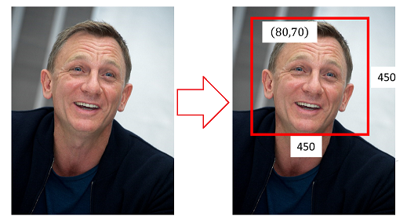

计算机视觉测试卷二

> - [x] 对于简单的计算机视觉问题，给出输入和输出的表示形式
> - [x] 了解KNN方法 • 基本原理 • 使用像素值表示图像特征的问题
> - [ ] 卷积运算 • 卷积运算及其性质 • 卷积运算的相关概念：跨度(stride)，填充(Padding),卷积核尺寸 • 理解卷积参数、图像大小与特征图尺寸的关系 • 理解卷积与特征提取的关系
> - [ ] 前馈神经网络 • 多层感知器的结构 • 多层次非线性变换，特征学习，深度学习
> - [ ] DCNN的训练 • BatchNormalization, DropOut, Data Augmentation, Transfer Learning
> - [ ] 图像分类实践 • 开发、诊断和调试图像分类模型
> - [ ] 滑动窗方法及其问题
> - [ ] 二阶段目标检测模型 • Anchor • RPN • Box Regression
> - [ ] 传统分割方法 • 阈值分割（像素分类） • 像素聚类 • 条件随机场模型（单点势函数与成对势函数的含义）
> - [ ] 问题定义 • 目标描述模型（表观模型） • 目标运动模型 • 预测+矫正
> - [ ] Image Captioning • RNN
> - [ ] Self-Supervised Learning • 一般原理 • Learning from Image Transformation • Contrastive Learning
>

**一、基础知识（$2 \times 25$）**

1. 如下图，输入图像$X$用于人脸位置检测，则输出$Y =_{\_\_\_\_\_\_\_\_\_\_\_\_\_\_\_}$ 。

   

2. 要确定一个羊是山羊还是绵羊，首先根据山羊、绵羊的特征首先学习出山羊和绵羊的模型，然后从这只羊中提取特征，分别放到山羊、绵羊模型中看分别概率是多少，哪个大就是哪个。这种方法称为$\_\_\_\_\_\_\_\_\_\_\_\_\_\_\_$模型方法。（求的是$P(X,Y)$，即联合概率）

3. 在K-NN中用图像像素值计算距离，难以跨越像素空间的欧氏距离与$\_\_\_\_\_\_\_\_\_\_\_\_\_\_\_$之间存在鸿沟。并且由于K-NN是无参方法，需要保存所有训练样本，带来了较大的存储开销。

4. 

**二、计算题（$2 \times 15$）**

**三、综合题（$2 \times 10$）**

