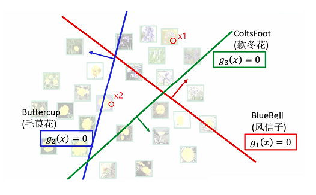

计算机视觉测试卷三

> - [x] 了解计算机视觉的难点：逆问题
> - [x] 图像分类的线性方法 • 打分函数，Softmax Regression，Logistic Regression • 损失函数（交叉熵损失） • 梯度下降法（会计算梯度） • 权值的直观解释（模板匹配）
> - [ ] 卷积特征 • 图像卷积特征的一般形式（Encoding+Pooling） • Encoding:如何表示一个图像块？（Kmeans,AutoEncoder,…） • Deep AutoEncoder
> - [ ] BP算法 • BP算法原理 • 对于小规模神经网络，可以手工推导梯度
> - [ ] 人脸识别 • 一般流程 • Siamese网络 • 人脸比对：人脸特征编码，特征比对 • TripleLoss, Contrastive Loss, Pair Classification
> - [ ] BP算法 • BP算法原理 • 对于小规模神经网络，可以手工推导梯度
> - [ ] 目标检测问题的定义 • 目标定位，目标检测
> - [ ] Viola-Jones人脸检测算法 • Harr小波特征 • AdaBoost分类器
> - [ ] 一阶段目标检测模型 • YOLO • SSD
> - [ ] DCNN图像分割 • 如何解决分辨率的问题？ • Encoer-Decoder框架 • UnPooling，Transposed Conv, Astrous Conv • 实例分割：Region Proposal + FCN
> - [ ] MeanShift Tracking
> - [ ] Self-Supervised Learning • 一般原理 • Learning from Image Transformation • Contrastive Learning
>

**一、基础知识（$2 \times 25$）**

1. 计算机视觉主要有如下的两个难点

   - $\_\_\_\_\_\_\_\_\_\_\_\_\_\_\_$，图像是三维世界在二维平面上的投影，而根据投影反求出三维空间信息是难解的问题。这也正是计算机视觉需要解决的。
   - $\_\_\_\_\_\_\_\_\_\_\_\_\_\_\_\_\_\_\_\_\_\_\_\_\_\_\_\_\_\_$，这个过程是未知、极其复杂的。

   对于第一个难点，目前可以使用先验的知识对问题添加约束，后一个难点可以使用数据驱动的方式，如模式识别、机器学习、大数据等。
   
2. 如下图中$g_i(x)$ 为线性分类器的决策面

   

   $x_1$ 对应的为$\_\_\_\_\_\_\_\_\_\_\_\_\_\_\_$花，$x_2$ 对应的为$\_\_\_\_\_\_\_\_\_\_\_\_\_\_\_$花。

3. 假设$𝑝, 𝑞$是定义在 $𝑌 = \{1,2, … , 𝑘\}$上的两个离散概率分布，则 $𝑝, 𝑞$之间的交叉熵为
   $$
   H(p, q)_{\_\_\_\_\_\_\_\_\_\_\_\_\_\_\_\_\_\_\_\_\_\_\_\_\_\_\_\_\_\_}
   $$
   其中 $p$ 为 $y$ 的真实分布分布，$q$ 为 $y$ 的预测分布。

   极小化交叉熵损失 $⇔$ 使预测的类别概率分布 $𝜌_1, 𝜌_2, ... , 𝜌_𝑘$ 与样本的真实类别概 率分布$(0,0, … , 1, …0)$尽可能接近。

   当$y = 3, Y = \{1,2,3\}$时，

   $y$ 的真实分布为$𝑝: 𝑝(𝑦 = 1) = 0, 𝑝(𝑦 = 2) = 0, 𝑝(𝑦 = 3) = 1$， 

   $ℎ$预测的分布为$q: q(𝑦 = 1) = \rho_1, q(𝑦 = 2) = \rho_2, q(𝑦 = 3) = \rho_3$

   则 $H(p, q)_{ \_\_\_\_\_\_\_\_\_\_\_\_\_\_\_\_\_\_\_\_\_\_\_\_\_\_\_\_\_\_}$ 。

4. 

**二、计算题（$2 \times 15$）**

1. Logistic Regression如下式定义：$ρ=g(x;W,b)= {1 \over (1+e^{-(W^Tx+b)} }$，采用交叉熵损失$L(W,b;x,y)$训练$W、b$。请写出损失函数的表达式，并推导出损失函数对参数$W$和$b$的偏导数。

**三、综合题（$2 \times 10$）**

