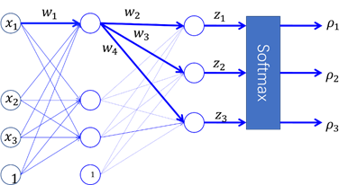

计算机视觉测试卷四

> - [x] 理解计算机视觉问题的解决方法： • 基于模型的方法（自顶向下） • 自底向上的方法（数据驱动、手工设计） • 
>
>   对于简单的视觉问题，可以根据这两类方法分别设计解决方案
>
> - [ ] 手工设计的图像特征 • 前人设计图像特征的经验 • 梯度特征，图像金字塔
>
> - [ ] 卷积运算 • 卷积运算及其性质 • 卷积运算的相关概念：跨度(stride)，填充(Padding),卷积核尺寸 • 理解卷积参数、图像大小与特征图尺寸的关系 • 理解卷积与特征提取的关系
>
> - [ ] 卷积神经网络 • 卷积网络相对于MLP的优势 • 卷积网络的工作原理（多层特征检测与复合） • 如何设计一个卷积网络
>
> - [ ] 几种典型的DCNN的结构及其设计思想 • VGG, GoogLeNet, ResNet
>
> - [ ] 词袋模型 • 什么是视觉单词？ • 视觉词袋模型如何表示图像？ • 如何获取视觉词典？ • 词袋模型的特点。
>
> - [ ] 目标包围盒重叠程度评价IOU
>
> - [ ] 图像分割问题定义
>
> - [ ] 二阶段目标检测模型 • Anchor • RPN • Box Regression
>
> - [ ] 相关滤波跟踪
>
> - [ ] Attention • Recurrent Attention Model • Soft Attention • Self-Attention, Transformer
>
> - [ ] DCNN图像分割 • 如何解决分辨率的问题？ • Encoer-Decoder框架 • UnPooling，Transposed Conv, Astrous Conv • 实例分割：Region Proposal + FCN

**一、基础知识（$2 \times 25$）**

1. 利用BoVW模型表示图像，获得图像的全局直方图表示，主要有四个关键步骤：

   Step 1：图像局部特征提取（Image Local Features Extrication）。

   Step 2：视觉词典构造（Visual Dictionary Construction）：训练图像的所有局部特征向量进行聚类分析，将$\_\_\_\_\_\_\_\_\_\_\_\_\_\_\_$定义为视觉单词。所有视觉单词组成视觉词典。

   Step 3：特征向量量化(Feature Vector Quantization)：通常采用最近邻搜索算法，搜索出$\_\_\_\_\_\_\_\_\_\_\_\_\_\_\_\_\_\_\_\_\_\_\_\_\_\_\_\_\_\_$ ，将视觉单词放入词袋中。

   Step 4：构建词频直方图：统计出视觉词典中每个视觉单词在该图像中出现的频数，按视觉单词索引顺序组成的一个数值向量。该向量即为图像的最终表示形式。

**二、计算题（$2 \times 15$）**

1. 下面是一个单隐层神经网络，输出层是一个3-Way Softmax，假设某个样本的真实类别的One-hot向量为$(0,0,1)$，采用交叉熵损失，激活函数使用Sigmoid函数，请用BP算法，推导出该样本上的损失l相对于图中参数$w_1$的偏导数。

   图中$w_1,w_2,w_3,w_4$表示对应连接上的权值参数，$z_1,z_2,z_3$表示输出层神经元的净响应。

   

**三、综合题（$2 \times 10$）**

1. 假设某工厂流水线上，使用机器手对传送带上的固定大小的包装箱进行抓取，如下图所示。机械手位于传送带上方的横梁上，机械手末端安装有摄像机，通过摄像机拍摄的图像，判断传送带上是否有包装箱，并估计包装箱的朝向、以及机械手与包装箱之间的距离。请针对这个应用场景，分别设计自顶向下和自底向上的计算机视觉解决方案。请具体说明，这个计算机视觉系统的输出结果是什么，并给出具体的表达形式。

   

2. 
