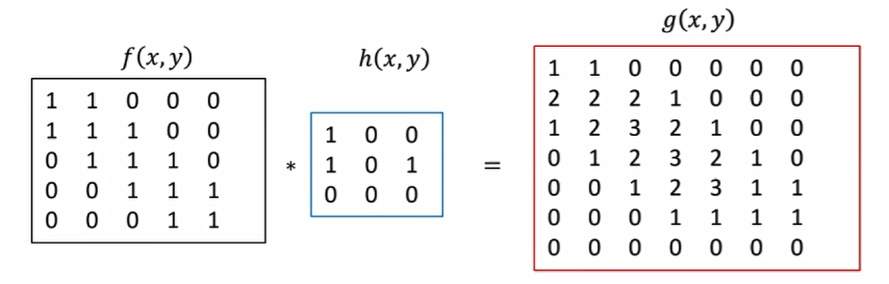

### 第三章

**全卷积 3-50**

**3-60**

观察上面两个卷积核以及卷积结果，发现卷积操作满足分配律。

$f * (h1 + h2 + h3) = f * h1 + f * h2 + f * h3$

**3-61**

**大卷积核分解为若干个小卷积核的卷积，可以减少计算量**

**3-70**

$(-1, 0, 1)$ ：边缘检测

$(1, 2, 1)^T$：平滑，去噪

3-92

做了Max-Pooling

3-93

$$
H = { {600 - 7} \over 2 + 1 } \quad W = { {800 - 7} \over 2 + 1 } \quad C = 16
$$
