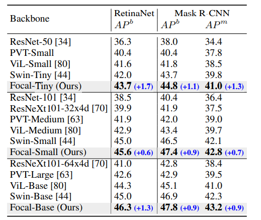

#### 题目：论文阅读的十个基本问题

本次我选取的论文是《Focal Self-attention for Local-Global Interactions in Vision Transformers》

##### 一、研究的问题是什么？

在高分辨率的图片上使用Self-Attention机制会带来过大的计算量，本文提出了一种 Focal Self-Attention 机制，研究如何来在高分辨率的图片上仍然可以使用 Self-Attention 机制。

##### 二、研究的意义是什么？

有助于拓宽Self-Attention机制在一些高清图片，以及高分辨率的视频上进行目标检测，图片分类等任务。

##### 三、研究的动机是什么？

传统的Self-Attention机制在高分辨率的图片上会带来过大的计算量，而最近的研究要么利用粗粒度全局自注意，要么利用细粒度局部自注意来减少计算负担。这两种方法都削弱了Self-Attention的建模能力。比如：同时模拟短期和长期视觉依赖的能力等。

##### 四、研究的方法是什么？

通过给出设计的模型，然后进行实验，比较当前的Focal Attention和一般的Self-Attention之间性能的差异。在方法的最后给出了一些实验上较好的参数设置。

##### 五、研究结论是什么？

使用Focal Self-Attention机制能在细粒度上实现了局部的Self-Attention，在粗粒度上实现了全局的Self-Attention，故在保证局部信息的同时，亦能兼顾较远的信息，从而在减少计算量的同时保证感受野不会减少。从而使该方法在图像分类、目标检测和分割方面都优于SoTA方法。

##### 六、研究的主体是如何展开的？

提出问题 $\rightarrow$ 分析现状 $\rightarrow$ 提出假设 $\rightarrow$ 设计模型 $\rightarrow$ 实验验证 $\rightarrow$ 同类比较 $\rightarrow$ 得出结论 $\rightarrow$ 不足和未来研究方向分析

##### 七、实验数据合理、评价指标公认、比较公平吗？

作者在COCO、Image-Net等数据集上同CNN、Transformer baselines 和 SoTA方法进行目标检测、图像分类、语义分割等方面比较，取得了较好成绩。

	
    
目标检测结果比较

测试数据集较为权威，评价指标公认，与之相比较的都是近些年流行的方法，并且进行了诸如目标检测、图像识别、语义分割等多个方面的对比试验，故公平。

##### 八、实验结果是如何证明结论的？

首先通过数学分析其复杂度和复杂，再通过在不同的数据集上进行研究，同其他的较为流行的架构进行多个方面的比较（目标检测、图像识别、语义分割等），最后得出文中提出的Focal Self-Attention机制具有优势。

##### 九、论文存在结构上、逻辑上或编辑方面的错误和不足吗？

我觉得不足之处在于没有给出验证代码。

##### 十、在本文研究的基础上还能展开哪些研究？

-  可以研究更高效的算法跟进一步的减少计算和空间上的花费。
-  从数学理论上更深一步的进行解释其可行性，如何朝着更好的方向进行优化。
-  如何将文中提出的新方法引用到其他邻域，如NLP等。