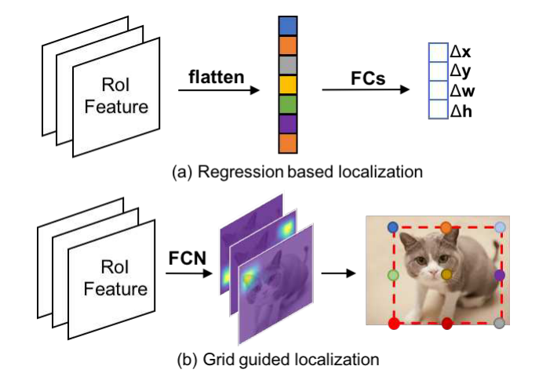
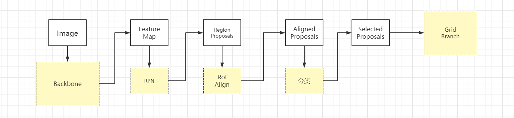

### 一、Grid R-CNN 

将以往通过回归方式实现proposal位置修正的方法，更改为通过全卷积网络来实现目标定位框的精确修正。

传统的生成Bounding Box的方法

> Typical bounding box localization module is a regression branch, which is designed as several fully connected layers and takes in high-level feature maps to predict the offset of the candidate box (proposal or predefined anchor).
>
> 典型的边界盒定位模块是一个回归分支，它被设计成几个全连接层，并采用高级特征图来预测候选框(提议或预定义锚)的偏移量。

而在 Grid R-CNN 中

> the traditional regression formulation is replaced by a grid point guided localization mechanism. 
>
> 传统的回归公式被网格点引导定位机制所取代。

Grid R-CNN divides the object bounding box region into grids and employs a fully convolutional network (FCN) to predict the locations of grid points.

### 二、Grid R-CNN Plus

将定位问题使用分类来做（保留原来的 区域建议网络RPN 和 classification）

说明几点

- `Aligned Proposals` 进行分类和定位
- 通过分类后的到的分数进行筛选，只有 TOP-K 能进入 Grid Branch

与 `Faster R-CNN` 的几点不同

1. 通过预测网格点而不是包围盒偏移来定位目标。然后由网格点来确定对象边界框

创新点

1. 网格点特定表示（grid point specific representation）
2. 

----

> 导读：Grid R-CNN将原（Faster R-CNN）中检测框偏移预估的问题转换为网格点预估问题，有了网格点的帮助，检测的性能有了进一步提升。

**改进一、Grid Point Specific Representation Region**

