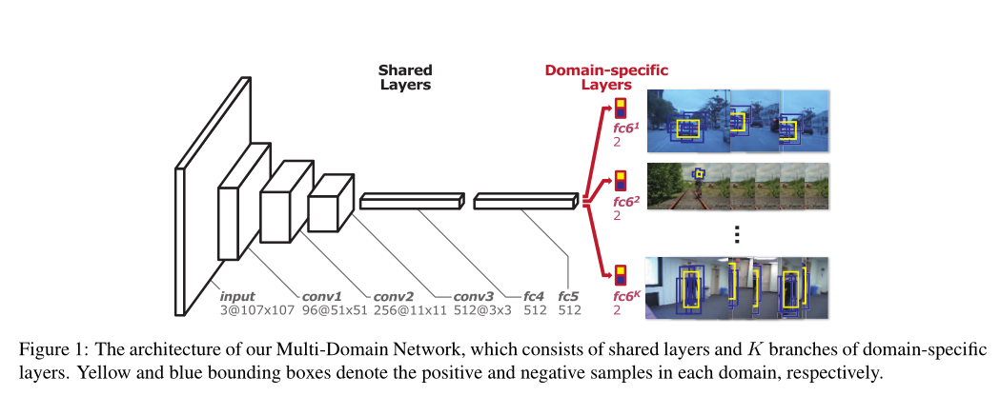

代码：https://github.com/hyeonseobnam/py-MDNet

 

论文动机

解决的主要问题

解决方法

主要结果

主要研究进展

# Introduction

CNN在视觉数据方面（分类、分割、检测等）的表现出色，但视觉跟踪难以受到影响，因为很难为视频处理应用收集大量训练数据，而且还没有专门用于视觉跟踪的训练算法。 [20, 44] 通过在大规模分类数据集（如 ImageNet [36]）上传输预训练的 CNN 来解决数据不足问题。但由于分类和跟踪问题之间的根本不一致，即预测对象类标签与定位任意类的目标，其在跟踪方面的有效性受到限制。

需要大规模数据集，数据集涵盖目标和背景组合的广泛变化。但根据具有完全不同特征的视频序列去学习统一表示具有挑战性。单个序列涉及不同类型的目标，且会遇到特定序列的挑战，如遮挡、光照变化。训练CNN的难处在于，同一个对象在一个序列中被认为是目标，在另一个序列可能被认为是背景对象。由于序列间的这种变化和不一致，认为基于标准分类任务的普通学习方法不合适。应该找到捕获到与序列无关的信息的方法。

以上包含了动机。

所以提出了全新的CNN架构，称为多域网络（MDNet）。MDNet 中的每个域都单独进行迭代训练，而共享层在每次迭代中都会更新。通过采用这种架构，将独立于领域的信息与特定领域的信息分开，并学习用于视觉跟踪的通用特征表示。另一方面，与用于分类任务的网络（如 AlexNet [28] 和 VGG 网络 [4, 37]）相比，该架构设计的 CNN 层数较少。

提出了一个在线跟踪框架，在测试序列时，会把训练阶段的所有二元分类层删除，构建一个新的分支来计算测试序列中的目标分数。为了适应新的域，在线微调新的分类层和共享层中的全连接。进行在线更新以分别模拟目标的长期和短期外观变化以获得稳健性和适应性，并且在学习过程中结合了有效和高效的硬负挖掘技术。

贡献：

设计了一个框架，共享层与特定层，有效捕获共享表示

我们的框架成功应用于视觉跟踪，其中通过多域学习预训练的 CNN 在新序列的上下文中在线更新，以自适应地学习特定领域的信息。 

有出色的性能

# Related Work

## Visual Tracking Algorithms

生成式。使用生成模型描述目标外观，并搜索最适合模型的目标区域。

sparse representation、density estimation、incremental subspace learning

判别式。建立一个模型来区分目标物体和背景

based on multiple instance learning, P-N learning, online boosting, structured output SVMs

虽然近年来，相关滤波器的方法在受限环境中是令人满意的，但它们有一个固有的局限性，即它们求助于低级别的手工特征，这些特征在动态情况下很容易受到攻击，包括照明变化、遮挡、变形等。

## Convolutional Neural Networks

CNN在分类和检测领域表现良好。但但到目前为止，仅提出了有限数量的使用CNN表示的跟踪算法，基于CNN的早期跟踪算法只能处理预定义的目标对象类。

尽管有人提出了基于CNN池的在线学习方法，但是缺乏训练数据。

本文算法利用大规模视觉跟踪数据对CNN进行预训练并获得有效的表示。

## Multi-Domain Learning

数据来源于多个域，并在学习过程中加入域信息的学习方法。

多领域学习在自然语言处理中很流行，但在计算机视觉领域，多域学习仅在少数领域自适应方法中讨论。

# Multi-Domain Network（MDNet）

## Network Architecture

输入为107*107

三个卷积层（conv1~3）。卷积层与VGG-M的相应部分相同，只是特征映射大小由我们的输入大小调整。

两个全连接层（fc4~5），有512个输出单元，并与ReLUs和dropout组合在一起。

最后一个完全连接层对应域的分支。每个分支包含一个具有softmax交叉熵损失的二元分类层，负责区分每个域中的目标和背景。

请注意，fc6为域特定层和前面的所有层称为共享层。

该架构是典型识别任务中的常见架构，如AlexNet和VGG。但由于以下原因，认为这种简单的体系结构更适合于视觉跟踪。

* 仅区分背景和目标，比一般视觉识别问题的模型复杂度低。
* 深度CNN对精确的目标定位效果较差，因为随着网络的深入，空间信息往往会被稀释
* 跟踪中的目标通常很小，因此网络的深度自然不会高
* 较小的网络在跟踪中跟有效。因为在线执行训练和测试，当测试较大网络时，算法的准确度较低，速度明显变慢。

## Learning Algorithm

学习算法的目标。训练一个在任意域中消除目标和背景歧义的多域CNN

虽然不容易，但是存在一些在所有领域中都是用于目标表示的共同特性，例如对照明变化、运动模糊、缩放变化的鲁棒性等。

为了提取满足这些共同特性的有用特征，通过合并一个多领域学习框架来分离领域无关信息和领域特定信息。

该CNN通过随机梯度下降训练（SGD），每个域在每次迭代中都是专门处理的。

在第k次中，网络根据一个小批量进行更新，该小批量由k序列中的训练样本组成，仅启用了fc6的第k哥分支。重复该过程，直到网络收敛或达到预定义的迭代次数。

通过该学习过程，在共享层中对与领域无关的信息进行建模，从中获得有用的通用特征表示。

# Online Tracking using MDNet

## Tracking Control and Network Update

长期更新被有规律地执行，使用被用作长期的正样本

无论何时，只要当正样本的评估分数低于0.5，就执行短期更新，在短期期间使用这些正样本。

这两种情况下，都是用短期内观察到的负样本，因为旧的负样本通常是多余的或与当前框架无关。

在跟踪期间维护一个单独的网络，根据目标外观的变化速度执行这两种更新。

为了评估每一帧的目标状态，在先前目标状态下采样的N个候选目标通过这个网络来评估，并且能够得到它们关于这个网络的正分数和负分数。

最优目标状态通过公式得到。

## Hard Minibatch Mining

只有少数分散注意力的负样本可以有效地训练分类器。这类负样本被称为困难负样本

因此，普通的SGD方法，即训练样本均匀地对学习起作用，很容易避免漂移问题，因为没有充分考虑干扰因素。

针对这个问题，目标检测中一个流行的方案是困难负样本挖掘。其中

训练和测试过程交替进行去识别困难负例，尤其是假正样本。

将Hard negative mining 集成到小批量选择中。

迭代过程中，一个小批包含正样本和困难负样本。

通过测试$M^-$个负样本并选择为首的$M^- _h$的分数来识别困难负样本

随着学习的进行，网络变得更具辨别力，小批量中的分类变得更具挑战性。这种方法检查预定义数量的样本，并有效地识别关键负例，而无需像标准困难负样本挖掘技术那样显式运行检测器来提取假正样本。